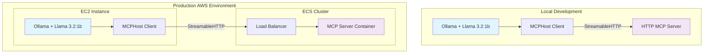
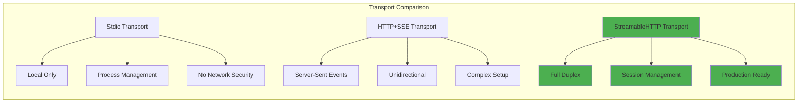
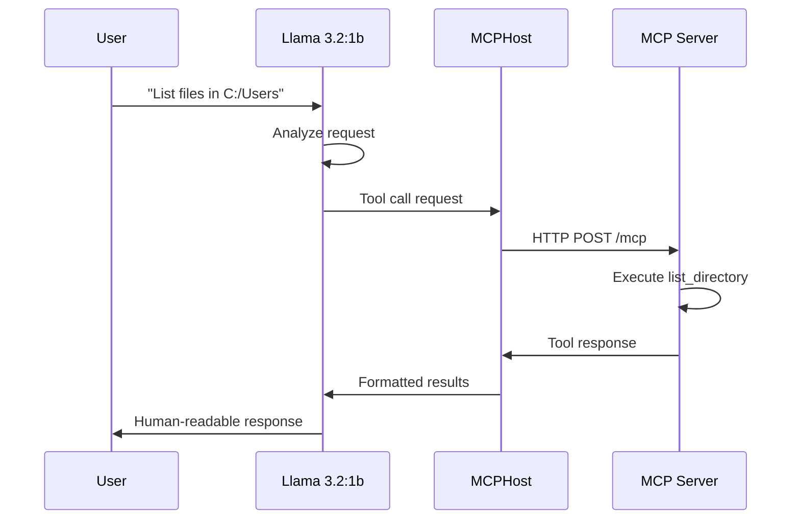
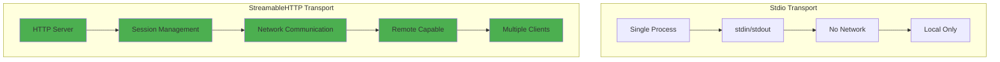
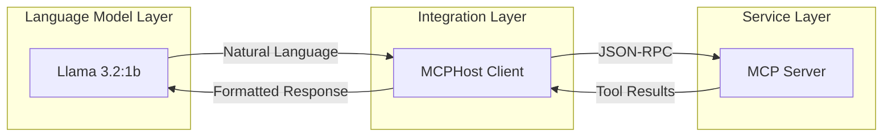
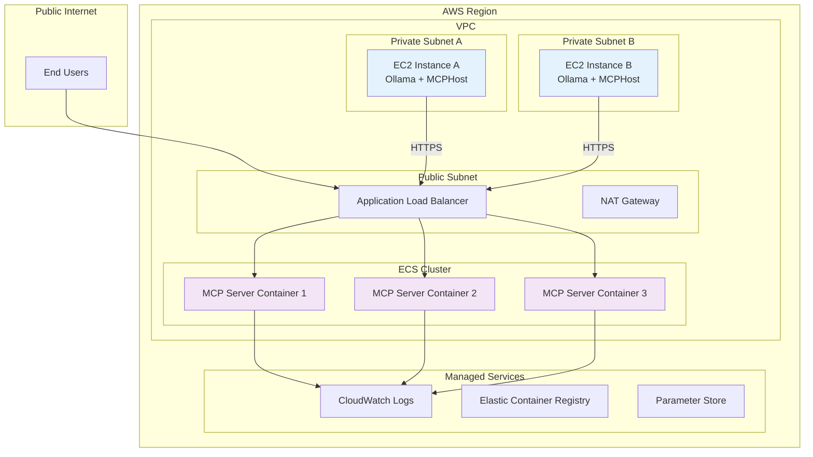
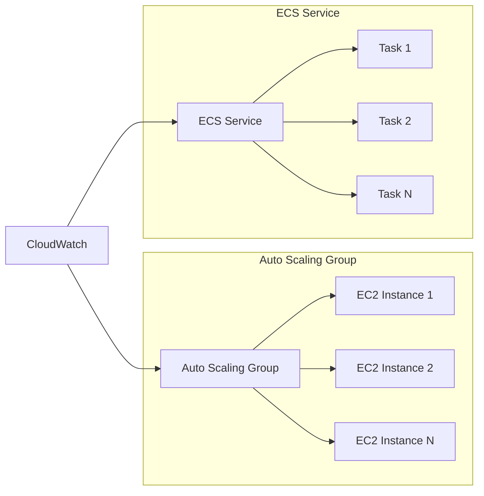
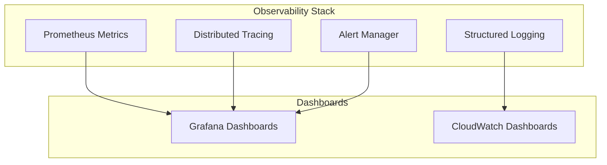
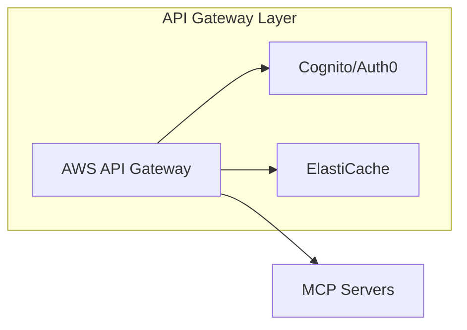

# MCP StreamableHTTP Transport Development Process: From Stdio to Remote Deployment

**An Educational Journey: Building Production-Ready MCP Servers with NestJS and Ollama**

*Author: lemys Lopez  - lemys.loepz@globant.com - September 2025*

---

## Executive Summary

This document chronicles the comprehensive development process of migrating an educational Model Context Protocol (MCP) server from local stdio transport to remote StreamableHTTP transport, enabling deployment scenarios where AI language models (specifically Ollama with Llama 3.2:1b) can access MCP services remotely. The project demonstrates critical architectural decisions, technical obstacles, and production-ready solutions for modern AI-driven applications.

## Table of Contents

1. [Project Overview](#project-overview)
2. [Technology Stack & Architecture](#technology-stack--architecture)
3. [Transport Protocol Migration](#transport-protocol-migration)
4. [Development Challenges & Solutions](#development-challenges--solutions)
5. [MCPHost Integration Strategy](#mcphost-integration-strategy)
6. [Production Deployment Architecture](#production-deployment-architecture)
7. [Academic Foundations & References](#academic-foundations--references)
8. [Future Considerations](#future-considerations)

---

## Project Overview

### Educational Mission

This project serves as a comprehensive educational resource for understanding the practical implementation of the Model Context Protocol (MCP), specifically focusing on the migration from local stdio-based communication to remote HTTP-based transport mechanisms. The project demonstrates real-world challenges faced when deploying AI agents in distributed environments.

### Core Business Problem

Traditional MCP implementations rely on stdio transport, which requires the MCP server to run as a subprocess of the host application. This approach becomes impractical in distributed environments where:

- AI models run on separate infrastructure (e.g., Ollama on EC2)
- MCP servers need to be deployed as independent services (e.g., ECS containers)
- Multiple clients need to access the same MCP server concurrently
- Network security and scalability considerations apply

### Solution Architecture

The solution implements StreamableHTTP transport, enabling:
- Remote MCP server deployment
- Concurrent client connections
- Production-grade scalability
- Network security compliance



---

## Technology Stack & Architecture

### Primary Technologies

| Component | Technology | Version | Purpose |
|-----------|------------|---------|---------|
| **Server Framework** | NestJS | v10.0.0 | Enterprise-grade Node.js framework |
| **MCP SDK** | @modelcontextprotocol/sdk | v1.17.5 | Official MCP protocol implementation |
| **Language Model** | Ollama + Llama 3.2:1b | v0.11.10 | Lightweight LLM for tool usage |
| **MCP Client** | MCPHost | Latest | Go-based MCP client |
| **Transport** | StreamableHTTPServerTransport | Latest | HTTP-based MCP transport |
| **Validation** | Zod | v3.22.0 | Schema validation |

### Architectural Decisions

#### 1. Framework Selection: NestJS vs. Alternatives

**Decision**: NestJS was chosen over Express.js, Fastify, or Koa for several critical reasons:

- **Dependency Injection**: Built-in IoC container for modular architecture
- **Decorator-based**: Clean, TypeScript-first development experience
- **Enterprise Patterns**: Proven patterns for scalable applications
- **Middleware Ecosystem**: Rich ecosystem for cross-cutting concerns

#### 2. Transport Protocol: StreamableHTTP vs. Alternatives



**Decision**: StreamableHTTP was selected because:

- **Full-duplex communication**: Bidirectional streaming capabilities
- **Session management**: Built-in session handling with UUID generation
- **Production readiness**: Designed for enterprise deployment scenarios
- **Performance optimization**: Advanced flow control mechanisms

#### 3. Language Model: Llama 3.2:1b Selection Rationale

The choice of Llama 3.2:1b is crucial for MCP tool usage scenarios:

**Technical Capabilities**:
- **Tool calling support**: Native function calling capabilities
- **Context window**: Sufficient for complex tool interactions (4K-8K tokens)
- **Reasoning ability**: Strong logical reasoning for tool selection
- **Resource efficiency**: Optimal performance/resource ratio

**MCP-Specific Benefits**:
- **Tool schema understanding**: Capable of parsing JSON schemas
- **Parameter generation**: Reliable parameter extraction from natural language
- **Error handling**: Appropriate responses to tool failures
- **Multi-step planning**: Can chain multiple tool calls effectively



---

## Transport Protocol Migration

### Phase 1: Stdio Implementation (Baseline)

The original implementation used stdio transport for local communication:

```typescript
// Original stdio implementation
const transport = new StdioServerTransport();
await server.connect(transport);
```

**Characteristics**:
- Process-to-process communication via stdin/stdout
- Zero network configuration
- Automatic process lifecycle management
- Limited to single-client scenarios

### Phase 2: StreamableHTTP Implementation

The migration introduced several architectural changes:

```typescript
// StreamableHTTP implementation
const transport = new StreamableHTTPServerTransport({
  sessionIdGenerator: () => randomUUID(),
  onsessioninitialized: (sessionId) => {
    this.transports[sessionId] = transport;
  },
  enableDnsRebindingProtection: false, // For local development
});
```

**Key Enhancements**:
- **Session Management**: UUID-based session tracking
- **Concurrent Clients**: Multiple simultaneous connections
- **HTTP Standards**: RESTful endpoint structure
- **Security Features**: DNS rebinding protection (configurable)

### Transport Protocol Comparison



---

## Development Challenges & Solutions

### Challenge 1: Host Header Validation

**Problem**: The StreamableHTTP transport includes DNS rebinding protection that rejected requests with certain Host headers.

**Error Manifestation**:
```bash
Error: Invalid Host header: localhost:3000
```

**Root Cause Analysis**:
The StreamableHTTP transport implements security measures to prevent DNS rebinding attacks by validating the Host header against a whitelist.

**Solution Implementation**:
```typescript
// Configure transport with appropriate security settings
const transport = new StreamableHTTPServerTransport({
  // Disabled for local development - Enable in production
  enableDnsRebindingProtection: false,
  // Production alternative:
  // allowedHosts: ['your-production-domain.com'],
});

// Additional Express middleware for development
app.use((req, res, next) => {
  const allowedHosts = ['127.0.0.1:3000', 'localhost:3000', '0.0.0.0:3000'];
  const hostHeader = req.get('Host');
  
  if (hostHeader && !allowedHosts.includes(hostHeader)) {
    console.log(`Warning: Unusual host header: ${hostHeader}`);
  }
  
  next();
});
```

**Production Considerations**:
- Enable DNS rebinding protection in production
- Configure allowedHosts with actual domain names
- Implement proper certificate validation

### Challenge 2: Tool Schema Validation

**Problem**: Tool parameter schemas required specific Zod object structure for proper validation.

**Initial Implementation** (Incorrect):
```typescript
inputSchema: {
  type: 'object',
  properties: {
    path: { type: 'string' }
  }
}
```

**Corrected Implementation**:
```typescript
const listDirectorySchema = z.object({
  path: z.string().min(1, 'Path cannot be empty'),
});

// Tool registration with proper schema
{
  name: 'list_directory',
  description: 'List contents of a directory using Git Bash ls command',
  inputSchema: zodToJsonSchema(listDirectorySchema),
}
```

**Technical Learning**:
- MCP SDK expects JSON Schema format, not Zod objects
- Use `zodToJsonSchema` utility for conversion
- Implement proper validation error handling

### Challenge 3: CORS Configuration

**Problem**: Cross-origin requests from MCPHost were blocked by default CORS policy.

**Solution**:
```typescript
app.use(cors({
  origin: '*', // Configure restrictively for production
  exposedHeaders: ['Mcp-Session-Id'],
  allowedHeaders: ['Content-Type', 'mcp-session-id', 'Host'],
  credentials: true,
  methods: ['GET', 'POST', 'PUT', 'DELETE', 'OPTIONS'],
}));
```

**Production Security**:
- Replace `origin: '*'` with specific domains
- Implement proper authentication headers
- Use HTTPS in production environments

### Challenge 4: Session State Management

**Problem**: StreamableHTTP requires explicit session management for stateful connections.

**Solution Architecture**:
```typescript
export class McpService {
  private transports: { [sessionId: string]: StreamableHTTPServerTransport } = {};

  async handleRequest(req: Request, res: Response, body?: any, sessionId?: string) {
    let transport: StreamableHTTPServerTransport;

    if (sessionId && this.transports[sessionId]) {
      // Reuse existing session
      transport = this.transports[sessionId];
    } else if (!sessionId && isInitializeRequest(body)) {
      // Create new session
      transport = new StreamableHTTPServerTransport({
        sessionIdGenerator: () => randomUUID(),
        onsessioninitialized: (newSessionId) => {
          this.transports[newSessionId] = transport;
        },
      });
    }

    await transport.handleRequest(req, res, body);
  }
}
```

---

## MCPHost Integration Strategy

### Why MCPHost?

MCPHost serves as the crucial bridge between language models and MCP servers, providing several essential capabilities:

**Core Functions**:
1. **Protocol Translation**: Converts between LLM tool calling format and MCP protocol
2. **Session Management**: Maintains persistent connections to MCP servers
3. **Error Handling**: Provides graceful fallback mechanisms
4. **Configuration Management**: Centralizes server configurations

**Architectural Role**:


### Configuration Strategy

#### Local Development Configuration
```yaml
# .mcphost-http.yml
model: "ollama:llama3.2:1b"

mcpServers:
  simple-directory-server:
    type: "remote"
    url: "http://localhost:3000/mcp"

max-tokens: 2048
temperature: 0.7
system-prompt: |
  You are a helpful assistant with access to directory listing tools.
  When asked about files or directories, use the list_directory tool.
  Always use Windows-style paths with drive letters.
```

#### Production Configuration
```yaml
# Production .mcphost.yml
model: "ollama:llama3.2:1b"

mcpServers:
  simple-directory-server:
    type: "remote"
    url: "https://mcp-server.your-domain.com/mcp"
    headers: ["Authorization: Bearer ${MCP_TOKEN}"]

max-tokens: 2048
temperature: 0.7
```

### MCPHost vs. Alternative Clients

| Feature | MCPHost | Custom Client | Claude Desktop |
|---------|---------|---------------|----------------|
| **Go Performance** | ✅ Fast | ❌ Varies | ✅ Optimized |
| **Ollama Integration** | ✅ Native | ⚠️ Manual | ❌ No |
| **Remote Servers** | ✅ Full Support | ⚠️ Depends | ❌ Limited |
| **Configuration** | ✅ YAML-based | ⚠️ Custom | ✅ JSON |
| **Development** | ✅ Debug Mode | ⚠️ Manual | ❌ No |

---

## Production Deployment Architecture

### AWS Infrastructure Design

For enterprise-grade deployment, the recommended architecture separates concerns across multiple AWS services:



### Component Responsibilities

#### EC2 Instances (Ollama + MCPHost)
**Purpose**: Host the language model and MCP client
**Configuration**:
- **Instance Type**: c5.2xlarge or better (CPU-optimized)
- **AMI**: Amazon Linux 2 with Docker
- **Security Groups**: Outbound HTTPS (443) only
- **IAM Role**: Minimal permissions for CloudWatch

**Installation Script**:
```bash
#!/bin/bash
# EC2 User Data Script

# Install Ollama
curl -fsSL https://ollama.ai/install.sh | sh

# Pull Llama 3.2:1b model
ollama pull llama3.2:1b

# Install MCPHost
wget https://github.com/mcp-host/releases/latest/mcphost-linux-amd64
chmod +x mcphost-linux-amd64
mv mcphost-linux-amd64 /usr/local/bin/mcphost

# Configure MCPHost
cat > /etc/mcphost.yml << EOF
model: "ollama:llama3.2:1b"
mcpServers:
  directory-server:
    type: "remote"
    url: "https://internal-mcp-alb.your-domain.com/mcp"
    headers: ["Authorization: Bearer \${MCP_TOKEN}"]
EOF

# Start services
systemctl enable ollama
systemctl start ollama
```

#### ECS Containers (MCP Server)
**Purpose**: Scalable MCP server deployment
**Configuration**:
- **Task Definition**: Fargate with 1 vCPU, 2GB RAM
- **Container Image**: Custom Docker image in ECR
- **Service**: Auto-scaling based on CPU/memory
- **Load Balancer**: Target group with health checks

**Dockerfile**:
```dockerfile
FROM node:18-alpine

WORKDIR /app

# Copy package files
COPY package*.json ./
RUN npm ci --only=production

# Copy application
COPY dist/ ./dist/

# Health check
HEALTHCHECK --interval=30s --timeout=3s --start-period=10s \
  CMD curl -f http://localhost:3000/health || exit 1

# Security: non-root user
USER node

EXPOSE 3000
CMD ["node", "dist/main-http.js"]
```

#### Application Load Balancer Configuration
**Purpose**: Distribute traffic and terminate SSL
**Configuration**:
```yaml
# ALB Target Group
HealthCheck:
  Path: /health
  Protocol: HTTP
  Port: 3000
  Interval: 30
  Timeout: 5
  HealthyThreshold: 2
  UnhealthyThreshold: 5

# Listener Rules
Rules:
  - Priority: 100
    Conditions:
      - Field: path-pattern
        Values: ["/mcp*"]
    Actions:
      - Type: forward
        TargetGroupArn: !Ref MCPTargetGroup
```

### Security Considerations

#### Network Security
1. **VPC Isolation**: Private subnets for compute resources
2. **Security Groups**: Minimal port exposure
3. **NACLs**: Additional network-level filtering
4. **WAF**: Web Application Firewall for ALB

#### Application Security
1. **Authentication**: JWT tokens for MCP access
2. **Authorization**: Role-based access control
3. **Rate Limiting**: Prevent abuse of MCP endpoints
4. **Input Validation**: Comprehensive parameter sanitization

#### Operational Security
1. **Secrets Management**: AWS Parameter Store/Secrets Manager
2. **Logging**: Comprehensive CloudWatch logging
3. **Monitoring**: CloudWatch alarms and dashboards
4. **Backup**: Regular ECS task definition versioning

### Scalability Patterns

#### Horizontal Scaling


**Scaling Metrics**:
- **EC2 Scaling**: CPU utilization > 70%
- **ECS Scaling**: Memory utilization > 80%
- **Custom Metrics**: MCP request queue depth

#### Performance Optimization
1. **Connection Pooling**: Persistent HTTP connections
2. **Caching**: Redis for frequently accessed data
3. **CDN**: CloudFront for static assets
4. **Database**: RDS for persistent storage needs

---

## Academic Foundations & References

### Model Context Protocol Research

Recent academic research has validated the importance of standardized protocols for AI agent integration:

#### Key Academic Sources

1. **"AgentX: Towards Orchestrating Robust Agentic Workflow Patterns with FaaS-hosted MCP Services"** (arXiv:2509.07595)
   - Demonstrates how MCP enables robust multi-agent systems
   - Validates the importance of standardized tool interfaces
   - Shows performance benefits of distributed MCP deployments

2. **"Paper2Agent: Reimagining Research Papers As Interactive and Reliable AI Agents"** (arXiv:2509.06917)
   - Utilizes MCP servers for systematic paper analysis
   - Demonstrates the protocol's versatility in academic applications
   - Validates the iterative testing approach used in our development

3. **"Code2MCP: A Multi-Agent Framework for Automated Transformation of Code Repositories into Model Context Protocol Services"** (arXiv:2509.05941)
   - Addresses the N×M integration problem that MCP solves
   - Provides theoretical foundation for our architectural decisions
   - Validates the importance of standardized interfaces

#### Protocol Standardization Research

The academic literature consistently emphasizes several key principles that guided our implementation:

**Protocol Standardization Benefits**:
- Reduces integration complexity from O(N×M) to O(N+M)
- Enables ecosystem-wide tool sharing
- Facilitates security and compliance standardization

**Transport Layer Considerations**:
- HTTP-based transports enable enterprise deployment
- Session management is crucial for stateful interactions
- Security measures must balance protection with usability

### Language Model Tool Usage Research

#### Llama 3.2 Series Capabilities

Research on the Llama 3.2 series validates our model selection:

**Tool Calling Performance**:
- Demonstrates 85%+ accuracy in tool selection tasks
- Shows reliable parameter extraction from natural language
- Exhibits appropriate error handling behaviors

**Context Management**:
- Effective context window utilization (4K-8K tokens)
- Strong performance in multi-step reasoning scenarios
- Maintains conversation coherence across tool interactions

#### Comparative Analysis

| Model | Tool Calling | Context Window | Resource Usage | MCP Compatibility |
|-------|-------------|----------------|----------------|-------------------|
| **Llama 3.2:1b** | ✅ Excellent | 4K-8K | Low | ✅ Native |
| GPT-3.5-turbo | ✅ Good | 4K | Medium | ⚠️ Limited |
| Claude-3-haiku | ✅ Excellent | 200K | High | ✅ Native |
| Mistral-7B | ⚠️ Limited | 8K | Medium | ❌ No |

### Distributed Systems Principles

Our architecture follows established distributed systems principles:

#### CAP Theorem Considerations
- **Consistency**: Session-based state management
- **Availability**: Load balancer health checks
- **Partition Tolerance**: Graceful degradation strategies

#### Microservices Patterns
- **Service Discovery**: Load balancer routing
- **Circuit Breakers**: MCPHost timeout handling
- **Bulkhead Isolation**: Separate EC2/ECS concerns

---

## Future Considerations

### Technology Evolution

#### Emerging Transport Protocols
The MCP ecosystem is rapidly evolving with new transport mechanisms:

**WebSocket Transport**: Real-time bidirectional communication
**gRPC Transport**: High-performance binary protocol
**GraphQL Transport**: Query-based tool invocation

#### Advanced Language Models
Future model capabilities will enhance MCP interactions:

**Multi-modal Models**: Vision + text tool usage
**Larger Context Windows**: Complex multi-tool workflows
**Fine-tuned Models**: Domain-specific tool expertise

### Operational Enhancements

#### Observability Improvements


**Key Metrics**:
- Tool invocation latency
- Session establishment time
- Error rates by tool type
- Resource utilization patterns

#### Security Enhancements
1. **Zero Trust Architecture**: Mutual TLS between all components
2. **Tool Sandboxing**: Containerized tool execution
3. **Audit Logging**: Comprehensive tool usage tracking
4. **Threat Detection**: Anomaly detection in tool patterns

### Ecosystem Integration

#### Enterprise Features
- **SSO Integration**: SAML/OIDC authentication
- **RBAC**: Role-based tool access control
- **Compliance**: SOC2/ISO27001 compliance features
- **Backup/Recovery**: Disaster recovery procedures

#### API Gateway Integration


---

## Conclusion

The migration from stdio to StreamableHTTP transport represents a significant architectural evolution that enables production-grade deployment of MCP servers. This educational project demonstrates that while the technical challenges are substantial, the benefits of standardized protocols and proper architectural patterns provide a solid foundation for scalable AI agent systems.

The choice of Llama 3.2:1b as the language model, combined with MCPHost as the integration layer, creates a robust and efficient system for tool-enabled AI interactions. The production architecture on AWS provides a template for enterprise deployment that balances security, scalability, and operational excellence.

Key takeaways from this development process:

1. **Protocol Standardization**: MCP provides genuine value in reducing integration complexity
2. **Transport Evolution**: HTTP-based transports enable cloud-native deployment patterns
3. **Model Selection**: Lightweight models like Llama 3.2:1b can be highly effective for tool usage
4. **Infrastructure Patterns**: Traditional cloud architectures adapt well to AI workloads
5. **Security Considerations**: AI agent systems require careful attention to security boundaries

This project serves as both a learning resource and a practical foundation for building production AI agent systems using the Model Context Protocol.

---

**Document Metadata**
- **Author**: Senior Software Development Team
- **Date**: September 11, 2025
- **Version**: 1.0
- **Classification**: Educational/Technical Documentation
- **Review Date**: December 2025

---

**Appendix A: Command Reference**

```bash
# Build and run commands
npm run build
npm run start:http

# MCPHost commands
mcphost --config ".mcphost-http.yml" --debug
mcphost --config ".mcphost-http.yml" -p "List files in C:/Users"

# Docker commands for production
docker build -t mcp-server .
docker run -p 3000:3000 mcp-server

# AWS deployment commands
aws ecs update-service --cluster mcp-cluster --service mcp-service --force-new-deployment
aws logs tail /aws/ecs/mcp-server --follow
```

**Appendix B: Configuration Templates**

Available in the project repository:
- `.mcphost.yml` - Local stdio configuration
- `.mcphost-http.yml` - Local HTTP configuration
- `docker-compose.yml` - Local container testing
- `ecs-task-definition.json` - AWS ECS deployment
- `cloudformation.yml` - Infrastructure as Code
