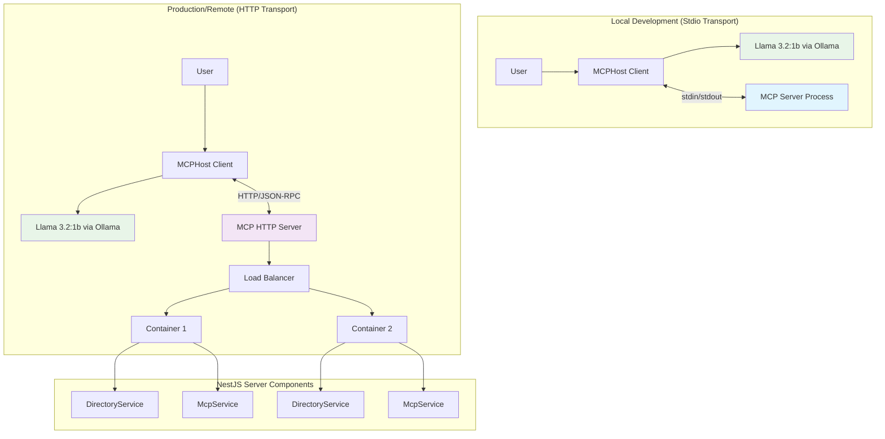
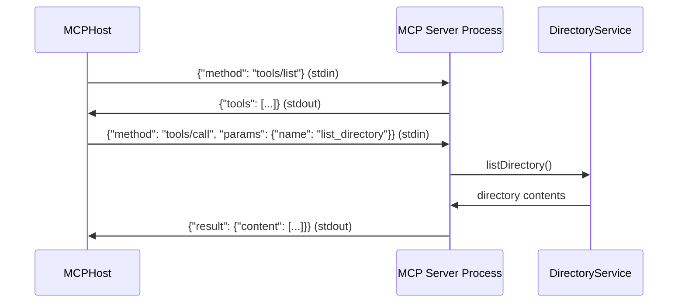
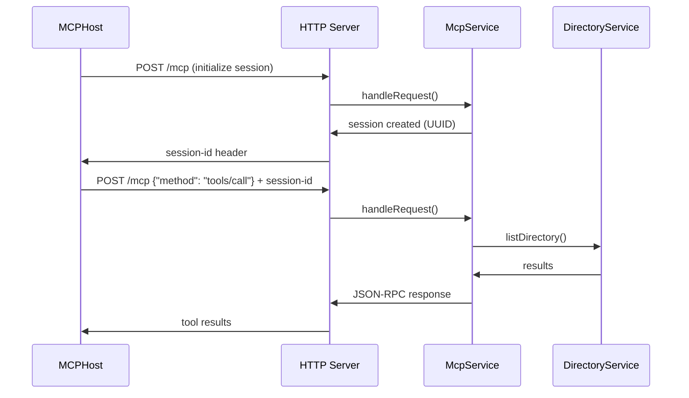
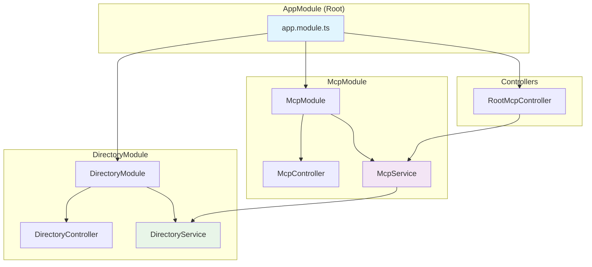

# 🎓 Educational MCP Server Project: Complete AI Tool Integration Guide

## 📚 **Educational Overview**

This project is a comprehensive educational example that demonstrates how Large Language Models (LLMs) can interact with external systems through the **Model Context Protocol (MCP)**. It's designed to teach the fundamental concepts of AI tool integration, protocol design, and modern AI application architecture with both **local stdio** and **remote HTTP** transport modes.

## 🧠 **What You'll Learn**

- **MCP Protocol Fundamentals** - How AI systems communicate with external tools
- **Dual Transport Modes** - Both stdio (local) and StreamableHTTP (remote) implementations
- **MCPHost Architecture** - Modern approach to AI tool management
- **Local AI Model Integration** - Using Ollama with Llama 3.2:1b
- **NestJS Enterprise Patterns** - Professional-grade Node.js application structure
- **Cross-Platform Development** - Windows and Linux setup procedures
- **Production Deployment** - Remote HTTP server capabilities for distributed systems

---

## 🔍 **Understanding MCP (Model Context Protocol)**

### What is MCP?

The **Model Context Protocol (MCP)** is a standard that enables Large Language Models to:
- 🛠️ **Access external tools** and services safely
- 🔄 **Maintain context** across interactions 
- 🔒 **Execute commands** with proper security boundaries
- 📡 **Communicate** with various systems and APIs
- 🌐 **Support multiple transports** - both local and remote connections

### MCP Architecture Explained



### Key MCP Components

1. **Host (MCPHost)** 
   - Manages AI model (Ollama/Llama 3.2:1b)
   - Handles user conversations
   - Discovers and calls MCP tools
   - Formats responses back to users
   - **Supports both local and remote servers**

2. **Server (Our NestJS App)**
   - Implements MCP protocol
   - Exposes tools via JSON-RPC
   - Handles actual system operations
   - Returns results to the host
   - **Dual transport support**: stdio + HTTP

3. **Transport Layer**
   - **Stdio**: Local process communication (development)
   - **StreamableHTTP**: Remote server communication (production)
   - JSON-RPC message format
   - Bidirectional data flow

---

## 🚀 **Why Use MCPHost with Ollama?**

### Traditional Approach Problems
```json
// ❌ Complex Ollama-only setup (EXPERIMENTAL)
// Requires editing system config files:
// %APPDATA%/Ollama/config.json (Windows)
// ~/.ollama/config.json (Linux)
{
  "experimental": {
    "mcp": {
      "servers": {
        "directory": {
          "command": ["node", "dist/main.js"],
          "args": [],
          "env": {}
        }
      }
    }
  }
}
```

### MCPHost Solution Benefits
```yaml
# ✅ Simple MCPHost configuration (.mcphost.yml)
model: "ollama:llama3.2:1b"
mcpServers:
  simple-directory-server:
    type: "local"                    # or "remote" for HTTP
    command: ["node", "dist/main.js"] # local mode
    # url: "http://server:3000/mcp"  # remote mode
```

**Why MCPHost is Superior:**
- 🎯 **Simplified Configuration** - Single YAML file vs complex JSON configs
- 🔧 **Better Debugging** - Clear error messages and tool discovery
- 🔄 **Multiple Model Support** - Easy switching between AI providers (Ollama, OpenAI, Claude)
- 🛡️ **Reliable Protocol** - More stable than Ollama's experimental MCP
- 📊 **Rich Features** - Interactive commands, streaming, history
- 🌍 **Environment Variables** - Flexible configuration management
- 🌐 **Remote Servers** - Production-ready HTTP transport support

---

## 🔌 **Understanding Transport Modes**

This project demonstrates **both transport modes** that MCP supports:

### 1. Stdio Transport (Local Development)

**What is Stdio Transport?**
- The **MCP server** reads from `stdin` and writes to `stdout`
- The **MCP host** writes to server's `stdin` and reads from `stdout`
- Messages are **JSON-RPC** formatted
- Communication is **bidirectional** and **asynchronous**
- **Perfect for**: Local development, single-user scenarios



**How Stdio Works in Our Project:**
```typescript
// src/main.ts - MCP Server Side
const transport = new StdioServerTransport();
await server.connect(transport);
// Server listens on stdin, responds on stdout
```

```yaml
# .mcphost.yml - MCPHost Side  
mcpServers:
  simple-directory-server:
    type: "local"
    command: ["node", "dist/main.js"]  # Starts our server
    # MCPHost connects via stdin/stdout
```

### 2. StreamableHTTP Transport (Production/Remote)

**What is StreamableHTTP Transport?**
- **HTTP-based** communication with **session management**
- **Full-duplex** streaming capabilities
- **Multiple concurrent clients** support
- **Network-based** - can run on different machines
- **Perfect for**: Production deployments, distributed systems, scalability



**How HTTP Works in Our Project:**
```typescript
// src/main-http.ts - HTTP Server
const app = await NestFactory.create(AppModule);
app.use(cors(/* MCP-compatible headers */));
await app.listen(3000, '0.0.0.0');
```

```typescript
// src/mcp/mcp.service.ts - StreamableHTTP Transport
const transport = new StreamableHTTPServerTransport({
  sessionIdGenerator: () => randomUUID(),
  onsessioninitialized: (sessionId) => {
    this.transports[sessionId] = transport;
  }
});
```

```yaml
# .mcphost-http.yml - MCPHost Side
mcpServers:
  simple-directory-server:
    type: "remote"
    url: "http://localhost:3000/mcp"
```

### Transport Comparison

| Feature | Stdio Transport | StreamableHTTP Transport |
|---------|----------------|--------------------------|
| **Use Case** | Local development | Production/Remote |
| **Clients** | Single client | Multiple concurrent |
| **Network** | No network needed | HTTP over network |
| **Scalability** | Limited | Highly scalable |
| **Session Management** | Process-based | UUID-based sessions |
| **Security** | Process isolation | HTTP + authentication |
| **Debugging** | Direct process logs | HTTP logs + monitoring |
| **Deployment** | Local only | Docker, Kubernetes, Cloud |

---

## 🏗️ **NestJS Architecture Deep Dive**

This project demonstrates professional **NestJS enterprise patterns** with clean separation of concerns:

### Module Structure



### 1. **AppModule** (`src/app.module.ts`)

**Purpose**: Root module that bootstraps the entire application

```typescript
@Module({
  imports: [DirectoryModule, McpModule],  // Feature modules
  controllers: [RootMcpController],       // HTTP MCP endpoints
  providers: [],                         // Global services
})
export class AppModule {}
```

**Key Responsibilities**:
- 🔗 **Module Composition** - Combines all feature modules
- 🌐 **HTTP Routing** - Configures root-level MCP endpoints
- 🚀 **Bootstrap** - Entry point for both stdio and HTTP servers

### 2. **DirectoryModule** (`src/directory/directory.module.ts`)

**Purpose**: Encapsulates all directory-related functionality

```typescript
@Module({
  controllers: [DirectoryController],  // HTTP REST endpoints
  providers: [DirectoryService],      // Business logic
  exports: [DirectoryService],        // Available to other modules
})
export class DirectoryModule {}
```

#### DirectoryService (`src/directory/directory.service.ts`)

**Purpose**: Core business logic for directory operations

**Key Features**:
```typescript
@Injectable()
export class DirectoryService {
  async listDirectory(path: string): Promise<string> {
    // 1. Path sanitization and corruption handling
    let cleanPath = this.sanitizePath(path);
    
    // 2. Git Bash execution (cross-platform Unix tools)
    const gitBashPath = 'C:\\Program Files\\Git\\bin\\bash.exe';
    const command = `"${gitBashPath}" -c "ls -la '${cleanPath}'"`;
    
    // 3. Fallback to PowerShell if Git Bash fails
    return this.executeWithFallback(command, path);
  }
}
```

**Why This Design?**:
- 🛡️ **Path Sanitization** - Handles MCPHost path corruption issues
- 🔧 **Cross-Platform** - Unix tools work consistently across platforms
- 🔄 **Fallback Strategy** - PowerShell backup if Git Bash unavailable
- ⚡ **Error Handling** - Comprehensive error management
- 🧪 **Testable** - Clean separation from transport layer

#### DirectoryController (`src/directory/directory.controller.ts`)

**Purpose**: HTTP REST interface for testing outside MCP

```typescript
@Controller('directory')
export class DirectoryController {
  @Get('list')
  async list(@Query('path') path?: string) {
    return this.directoryService.listDirectory(path || '.');
  }
}
```

**Educational Value**:
- 🧪 **Direct Testing** - Test service without MCP complexity
- 🔍 **HTTP Interface** - Compare HTTP vs MCP protocols
- 📚 **Learning Tool** - Understand different API patterns

### 3. **McpModule** (`src/mcp/mcp.module.ts`)

**Purpose**: Handles MCP protocol implementation and HTTP transport

```typescript
@Module({
  imports: [DirectoryModule],      // Depends on directory functionality
  controllers: [McpController],    // MCP-specific HTTP routes
  providers: [McpService],         // MCP protocol logic
  exports: [McpService],           // Available to root controller
})
export class McpModule {}
```

#### McpService (`src/mcp/mcp.service.ts`)

**Purpose**: StreamableHTTP transport and session management

**Key Responsibilities**:
```typescript
@Injectable()
export class McpService implements OnModuleDestroy {
  private transports: { [sessionId: string]: StreamableHTTPServerTransport } = {};

  async handleRequest(req: Request, res: Response, body?: any, sessionId?: string) {
    // 1. Session management - reuse or create new
    let transport = this.getOrCreateTransport(sessionId, body);
    
    // 2. Tool registration using modern MCP SDK
    server.registerTool('list_directory', schema, handler);
    
    // 3. Request delegation to transport
    await transport.handleRequest(req, res, body);
  }
}
```

**Advanced Features**:
- 🆔 **Session Management** - UUID-based session tracking
- 🔄 **Transport Reuse** - Efficient connection pooling
- 🛡️ **Error Handling** - Comprehensive error management
- 🧹 **Resource Cleanup** - Proper lifecycle management
- 🔧 **Modern MCP SDK** - Latest protocol features

#### RootMcpController (`src/root-mcp.controller.ts`)

**Purpose**: HTTP endpoints for MCP protocol at application root

```typescript
@Controller()  // Root level - handles /mcp directly
export class RootMcpController {
  @Post('mcp')   // POST /mcp - primary MCP endpoint
  @Get('mcp')    // GET /mcp - tool discovery
  @Delete('mcp') // DELETE /mcp - session cleanup
  async handleMcp(@Req() req, @Res() res, @Body() body, @Headers('mcp-session-id') sessionId) {
    await this.mcpService.handleRequest(req, res, body, sessionId);
  }
}
```

**HTTP Method Mapping**:
- **POST /mcp** - Tool calls, initialization, main protocol
- **GET /mcp** - Health checks, capability discovery
- **DELETE /mcp** - Session cleanup, resource management

### 4. **Entry Points**

#### Stdio Entry Point (`src/main.ts`)
```typescript
async function bootstrap() {
  // 1. Create NestJS application context (no HTTP server)
  const app = await NestFactory.createApplicationContext(AppModule);
  
  // 2. Get services via dependency injection
  const directoryService = app.get(DirectoryService);
  
  // 3. Create MCP server with stdio transport
  const server = new Server({name: 'simple-directory-mcp-server'});
  const transport = new StdioServerTransport();
  
  // 4. Register tools and connect
  await server.connect(transport);
}
```

#### HTTP Entry Point (`src/main-http.ts`)
```typescript
async function bootstrap() {
  // 1. Create full NestJS HTTP application
  const app = await NestFactory.create(AppModule);
  
  // 2. Configure CORS for MCP compatibility
  app.use(cors({exposedHeaders: ['Mcp-Session-Id']}));
  
  // 3. Start HTTP server
  await app.listen(3000, '0.0.0.0');
}
```

### Design Pattern Benefits

#### 1. **Dependency Injection**
```typescript
// McpService automatically gets DirectoryService injected
constructor(private readonly directoryService: DirectoryService) {}
```

#### 2. **Module Encapsulation**
- Each module owns its domain
- Clear export/import boundaries
- Easy to test in isolation

#### 3. **Single Responsibility**
- **DirectoryService**: Business logic only
- **McpService**: Protocol handling only  
- **Controllers**: HTTP routing only

#### 4. **Scalability**
- Easy to add new tools as separate modules
- Each module can have its own database/config
- Horizontal scaling with multiple instances

---

## 📋 **Complete Setup Guide**

### 🖥️ **Windows Setup**

#### Prerequisites Installation

**1. Install Node.js (v18+)**
```powershell
# Download from https://nodejs.org or use winget
winget install OpenJS.NodeJS

# Verify installation
node --version  # Should show v18.x.x or higher
npm --version
```

**2. Install Git (includes Git Bash)**
```powershell
# Download from https://git-scm.com or use winget
winget install Git.Git

# Verify Git Bash is available
Test-Path "C:\Program Files\Git\bin\bash.exe"  # Should return True
```

**3. Install Go (required for MCPHost)**
```powershell
# Download from https://golang.org or use winget
winget install GoLang.Go

# Verify installation
go version  # Should show go version 1.21+

# Add Go bin to PATH if not already done
$env:PATH += ";$env:USERPROFILE\go\bin"
[Environment]::SetEnvironmentVariable("PATH", $env:PATH, "User")
```

**4. Install MCPHost**
```powershell
# Install MCPHost using Go
go install github.com/mark3labs/mcphost@latest

# Verify installation
mcphost --version
# If command not found, restart PowerShell or check PATH
```

**5. Install Ollama**
```powershell
# Download from https://ollama.ai and install
# Or use PowerShell to download
Invoke-WebRequest -Uri "https://ollama.ai/download/windows" -OutFile "OllamaSetup.exe"
Start-Process -FilePath "OllamaSetup.exe" -Wait

# Verify Ollama installation
ollama --version
```

**6. Download Llama 3.2:1b Model**
```powershell
# Start Ollama service (usually auto-starts after installation)
ollama serve

# In another PowerShell window, pull the model
ollama pull llama3.2:1b

# Verify model is available
ollama list  # Should show llama3.2:1b in the list
```

#### Project Setup (Windows)
```powershell
# Clone the repository
git clone https://github.com/yourusername/simple-mcp.git
cd simple-mcp

# Install Node.js dependencies
npm install

# Build the project
npm run build

# Verify build succeeded
Test-Path "dist/main.js"      # Should return True
Test-Path "dist/main-http.js" # Should return True
```

### 🐧 **Linux Setup**

#### Prerequisites Installation (Ubuntu/Debian)

**1. Install Node.js (v18+)**
```bash
# Using NodeSource repository for latest version
curl -fsSL https://deb.nodesource.com/setup_18.x | sudo -E bash -
sudo apt-get install -y nodejs

# Verify installation
node --version  # Should show v18.x.x or higher
npm --version
```

**2. Install Git (usually pre-installed)**
```bash
# Install if not available
sudo apt-get update
sudo apt-get install -y git

# Verify installation
git --version
which bash  # Should show /bin/bash
```

**3. Install Go (required for MCPHost)**
```bash
# Remove old Go installation if exists
sudo rm -rf /usr/local/go

# Download and install latest Go
wget https://go.dev/dl/go1.21.5.linux-amd64.tar.gz
sudo tar -C /usr/local -xzf go1.21.5.linux-amd64.tar.gz

# Add to PATH
echo 'export PATH=$PATH:/usr/local/go/bin:$HOME/go/bin' >> ~/.bashrc
source ~/.bashrc

# Verify installation
go version  # Should show go version 1.21+
```

**4. Install MCPHost**
```bash
# Install MCPHost using Go
go install github.com/mark3labs/mcphost@latest

# Verify installation
mcphost --version
# If command not found, ensure $HOME/go/bin is in PATH
```

**5. Install Ollama**
```bash
# Install Ollama using the official script
curl -fsSL https://ollama.ai/install.sh | sh

# Verify installation
ollama --version

# Start Ollama service
ollama serve &
```

**6. Download Llama 3.2:1b Model**
```bash
# Pull the model (Ollama service should be running)
ollama pull llama3.2:1b

# Verify model is available
ollama list  # Should show llama3.2:1b in the list
```

#### Project Setup (Linux)
```bash
# Clone the repository
git clone https://github.com/yourusername/simple-mcp.git
cd simple-mcp

# Install Node.js dependencies
npm install

# Build the project
npm run build

# Verify build succeeded
ls -la dist/main.js      # Should exist
ls -la dist/main-http.js # Should exist
```

### 🍎 **macOS Setup**

#### Prerequisites Installation

**1. Install Node.js (v18+)**
```bash
# Using Homebrew (install Homebrew first from https://brew.sh)
brew install node

# Verify installation
node --version  # Should show v18.x.x or higher
npm --version
```

**2. Install Git (usually pre-installed)**
```bash
# Install if not available
brew install git

# Verify installation
git --version
which bash  # Should show /bin/bash
```

**3. Install Go**
```bash
# Using Homebrew
brew install go

# Verify installation
go version  # Should show go version 1.21+
```

**4. Install MCPHost**
```bash
# Install MCPHost using Go
go install github.com/mark3labs/mcphost@latest

# Verify installation (may need to add Go bin to PATH)
mcphost --version
```

**5. Install Ollama**
```bash
# Download and install from https://ollama.ai
# Or use Homebrew
brew install ollama

# Verify installation
ollama --version

# Start Ollama service
ollama serve &
```

**6. Download Model**
```bash
# Pull the model
ollama pull llama3.2:1b

# Verify model is available
ollama list
```

---

## 🚀 **Running the Project**

### Mode 1: Local Development (Stdio Transport)

**Automated Startup (Windows)**
```powershell
# Use the provided PowerShell script
.\restart.ps1

# Or manually step by step:
# 1. Ensure Ollama is running
ollama serve

# 2. Build project (if needed)
npm run build

# 3. Start MCPHost with stdio configuration
mcphost --config .mcphost.yml
```

**Automated Startup (Linux/macOS)**
```bash
# Use the provided bash script
./restart.sh

# Or manually step by step:
# 1. Ensure Ollama is running
ollama serve &

# 2. Build project (if needed)
npm run build

# 3. Start MCPHost with stdio configuration
mcphost --config .mcphost.yml
```

### Mode 2: Production/Remote (HTTP Transport)

**Start HTTP Server**
```powershell
# Windows
.\start-http-server.ps1

# Or manually:
npm run start:http
# Server will be available at http://localhost:3000/mcp
```

```bash
# Linux/macOS - manually start HTTP server
npm run start:http
```

**Connect MCPHost to HTTP Server**
```powershell
# Windows - in another terminal
mcphost --config .mcphost-http.yml

# Linux/macOS - in another terminal  
mcphost --config .mcphost-http.yml
```

### All-in-One Startup (HTTP Mode)
```powershell
# Windows - starts both HTTP server and MCPHost
.\start-http-mcphost.ps1
```

### Configuration Files Explained

#### Local Stdio Configuration (`.mcphost.yml`)
```yaml
# AI Model Configuration
model: "ollama:llama3.2:1b"

# MCP Server Configuration - LOCAL MODE
mcpServers:
  simple-directory-server:
    type: "local"                         # Run as subprocess
    command: ["node", "dist/main.js"]     # Command to start our server
    environment:                          # Environment variables
      NODE_ENV: "production"
      DEBUG: "${env://DEBUG:-false}"      # With fallback defaults

# Model Parameters (optimized for Llama 3.2:1b)
max-tokens: 2048
temperature: 0.7      # Creativity level (0.0 = deterministic, 1.0 = creative)
top-p: 0.95          # Nucleus sampling
top-k: 40            # Top-k sampling

# System prompt for directory operations
system-prompt: |
  You are a helpful assistant with access to directory listing tools.
  When asked about files or directories, use the list_directory tool.
  Always use forward slashes (/) in paths, even on Windows systems.
  Current directory path is C:/Users/lemys.lopez
```

#### Remote HTTP Configuration (`.mcphost-http.yml`)
```yaml
# AI Model Configuration
model: "ollama:llama3.2:1b"

# MCP Server Configuration - REMOTE MODE  
mcpServers:
  simple-directory-server:
    type: "remote"                        # Connect to HTTP server
    url: "http://localhost:3000/mcp"      # HTTP endpoint
    # Optional authentication headers:
    # headers: ["Authorization: Bearer token"]

# Same model parameters as local mode
max-tokens: 2048
temperature: 0.7
top-p: 0.95
top-k: 40

# Enhanced system prompt for HTTP mode
system-prompt: |
  You are a helpful assistant with access to directory listing tools.
  Always use Windows-style paths with drive letters (e.g., C:/Users/lemys.lopez).
  Current user directory is C:/Users/lemys.lopez
  Common folders:
  - Projects: C:/Users/lemys.lopez/projects
  - Desktop: C:/Users/lemys.lopez/Desktop  
  - Documents: C:/Users/lemys.lopez/Documents
```

---

## 🧪 **Testing and Usage**

### Basic Usage Examples

**1. Starting a Session**
```
$ mcphost --config .mcphost.yml
🚀 MCPHost started with Llama 3.2:1b
💡 Available commands: /help, /tools, /quit

You: /tools
Assistant: Available tools:
- list_directory: List contents of a directory using Git Bash ls command

You: List the files in C:/Users
Assistant: I'll check the contents of C:/Users for you.
[calls list_directory tool]
Here are the files and directories in C:/Users:
drwxr-xr-x  1 user1 user1  4096 Dec 15 10:30 user1
drwxr-xr-x  1 user2 user2  4096 Dec 15 10:25 user2
...
```

**2. Natural Language Queries**
```
You: What's in my projects folder?
Assistant: I'll check your projects folder for you.
[calls list_directory with path: "C:/Users/lemys.lopez/projects"]
Here's what's in your projects folder:
drwxr-xr-x  1 user user  4096 Dec 15 10:30 simple-mcp
drwxr-xr-x  1 user user  4096 Dec 10 15:20 another-project
...

You: Show me the current directory
Assistant: I'll list the current directory contents.
[calls list_directory with path: "."]
...
```

**3. Error Handling**
```
You: List files in /invalid/path
Assistant: I'll try to list the contents of /invalid/path.
[calls list_directory]
I encountered an error: Directory not found or access denied.
```

### Testing Different Transport Modes

**Test Stdio Mode (Local)**
```powershell
# Terminal 1: Start MCPHost with stdio
mcphost --config .mcphost.yml

# Should automatically start our Node.js server as subprocess
# and connect via stdin/stdout
```

**Test HTTP Mode (Remote)**
```powershell
# Terminal 1: Start HTTP server
npm run start:http
# Should show: MCP endpoint available at http://localhost:3000/mcp

# Terminal 2: Test HTTP endpoint directly
curl -X POST http://localhost:3000/mcp -H "Content-Type: application/json"

# Terminal 3: Start MCPHost with HTTP config
mcphost --config .mcphost-http.yml
# Should connect to the HTTP server
```

### Direct Testing (Without MCPHost)

**Test HTTP Endpoints**
```powershell
# Test directory service directly via REST API
curl "http://localhost:3000/directory/list?path=C:/Users"

# Test MCP HTTP endpoint (requires proper JSON-RPC)
curl -X POST http://localhost:3000/mcp \
  -H "Content-Type: application/json" \
  -d '{"jsonrpc":"2.0","id":1,"method":"tools/list"}'
```

**Test Stdio Mode Manually**
```powershell
# Start our MCP server directly
node dist/main.js

# In the same terminal, type JSON-RPC commands:
{"jsonrpc":"2.0","id":1,"method":"tools/list"}
# Press Enter - should return list of available tools

{"jsonrpc":"2.0","id":2,"method":"tools/call","params":{"name":"list_directory","arguments":{"path":"C:/Users"}}}
# Press Enter - should return directory listing
```

### MCPHost Interactive Commands

Once MCPHost is running, you can use these commands:

```bash
/help          # Show all available commands
/tools         # List available MCP tools  
/quit          # Exit MCPHost
/models        # Show available AI models
/config        # Show current configuration
/debug         # Toggle debug mode
/clear         # Clear conversation history
```

### Debugging

**Enable Debug Mode**
```powershell
# Set environment variables for debugging
$env:DEBUG = "true"
$env:NODE_ENV = "development"

# Start with debug logging
mcphost --debug --config .mcphost.yml
```

**View Logs**
- **Stdio Mode**: Server logs appear in MCPHost output
- **HTTP Mode**: Server logs in the terminal running `npm run start:http`
- **MCPHost Logs**: Use `--debug` flag for detailed protocol logs

---

## 🔍 **Understanding the Code Flow**

### Complete Request Flow

1. **User Input** → MCPHost receives natural language
2. **AI Processing** → Llama 3.2:1b determines it needs a tool
3. **Tool Discovery** → MCPHost asks our server for available tools
4. **Tool Selection** → AI chooses `list_directory` tool
5. **Parameter Extraction** → AI determines path parameter from context
6. **MCP Call** → MCPHost sends JSON-RPC request via stdin
7. **Server Processing** → Our DirectoryService handles the request
8. **System Command** → Service executes Git Bash `ls` command
9. **Response Formatting** → Service formats output for MCP
10. **Return to Host** → JSON-RPC response sent via stdout
11. **AI Integration** → MCPHost gives result to AI model
12. **User Response** → AI formats final answer for user

### Message Examples

**Tool Discovery Request:**
```json
{
  "jsonrpc": "2.0",
  "id": 1,
  "method": "tools/list"
}
```

**Tool Discovery Response:**
```json
{
  "jsonrpc": "2.0", 
  "id": 1,
  "result": {
    "tools": [{
      "name": "list_directory",
      "description": "List contents of a directory using Git Bash ls command",
      "inputSchema": {
        "type": "object",
        "properties": {"path": {"type": "string"}},
        "required": ["path"]
      }
    }]
  }
}
```

**Tool Execution Request:**
```json
{
  "jsonrpc": "2.0",
  "id": 2,
  "method": "tools/call",
  "params": {
    "name": "list_directory",
    "arguments": {"path": "C:/Users"}
  }
}
```

---

## 🎓 **Educational Extensions**

### Beginner Projects
1. **Add File Reading Tool**
   ```typescript
   // Add to DirectoryService
   async readFile(path: string): Promise<string> {
     // Implementation
   }
   
   // Add to MCP handlers in main.ts
   ```

2. **Add File Writing Tool**
   ```typescript
   async writeFile(path: string, content: string): Promise<string> {
     // Safe file writing implementation
   }
   ```

3. **Add Directory Creation Tool**
   ```typescript
   async createDirectory(path: string): Promise<string> {
     // Directory creation with proper error handling
   }
   ```

### Intermediate Projects
1. **Multiple MCP Servers**
   - Create separate servers for different domains
   - File operations server
   - System information server
   - Network tools server

2. **Advanced Error Handling**
   - Permission checking before operations
   - Path validation and sanitization
   - User-friendly error messages

3. **Configuration Management**
   - Environment-specific configs
   - User preferences
   - Security policies

### Advanced Projects
1. **Remote MCP Server**
   - Convert to HTTP transport
   - Add authentication
   - Multi-tenant support

2. **Custom MCPHost Integration**
   - Build your own MCP host
   - Custom AI model integration
   - Specialized user interfaces

---

## 🐛 **Troubleshooting Guide**

### Common Issues and Solutions

**Issue**: MCPHost can't find our server
```powershell
# Check if built correctly
Test-Path "dist/main.js"  # Should return True
npm run build             # If false, rebuild
```

**Issue**: Git Bash not found
```powershell
# Find Git Bash location
Get-Command bash -ErrorAction SilentlyContinue
# Update path in directory.service.ts if different
```

**Issue**: Ollama connection problems
```powershell
# Check Ollama status
ollama list                    # Should show llama3.2:1b
ollama serve                   # Start if not running
ollama run llama3.2:1b        # Test model directly
```

**Issue**: Path handling errors
```
# Enable debug mode to see path processing
$env:DEBUG = "true"
mcphost --debug
```

### Debug Mode
```powershell
# Enable comprehensive debugging
$env:DEBUG = "true"
$env:NODE_ENV = "development"
mcphost --debug --config .mcphost.yml
```

---

## 📚 **Learning Resources**

### MCP Protocol
- [Official MCP Specification](https://spec.modelcontextprotocol.io/)
- [MCP SDK Documentation](https://github.com/modelcontextprotocol/typescript-sdk)

### MCPHost
- [MCPHost Repository](https://github.com/mark3labs/mcphost)
- [MCPHost Documentation](https://github.com/mark3labs/mcphost/blob/main/README.md)

### Ollama
- [Ollama Documentation](https://ollama.ai/docs)
- [Llama Model Information](https://ollama.ai/library/llama3.2)

### NestJS
- [NestJS Documentation](https://docs.nestjs.com/)
- [NestJS Fundamentals](https://docs.nestjs.com/first-steps)

---

## 🎯 **Key Learning Outcomes**

After working with this project, you should understand:

### Technical Concepts
- ✅ **MCP Protocol** - How AI systems communicate with external tools
- ✅ **Stdio Transport** - Inter-process communication mechanisms
- ✅ **JSON-RPC** - Remote procedure call protocol
- ✅ **AI Tool Integration** - Practical AI application architecture

### Practical Skills
- ✅ **Building MCP Servers** - Creating tools for AI systems
- ✅ **Configuration Management** - YAML configs and environment variables
- ✅ **Error Handling** - Robust system integration
- ✅ **System Integration** - Connecting different technologies

### Architecture Patterns
- ✅ **Service-Oriented Design** - Clean separation of concerns
- ✅ **Protocol Implementation** - Standard communication patterns
- ✅ **Dependency Injection** - Modern application structure
- ✅ **Cross-Platform Development** - Consistent behavior across systems

---

## � **Learning Resources and Educational Extensions**

### Understanding MCP Concepts

**1. Model Context Protocol (MCP) Fundamentals**
- **Purpose**: Standardized protocol for AI models to access external tools and data
- **Architecture**: Client ↔ Server communication via JSON-RPC
- **Transports**: Stdio (local), HTTP (remote), WebSocket (real-time)
- **Tools**: Functions that AI models can call to interact with systems

**2. JSON-RPC Protocol Examples**

**Tool Discovery Request:**
```json
{
  "jsonrpc": "2.0",
  "id": 1,
  "method": "tools/list"
}
```

**Tool Discovery Response:**
```json
{
  "jsonrpc": "2.0",
  "id": 1,
  "result": {
    "tools": [
      {
        "name": "list_directory",
        "description": "List contents of a directory using Git Bash ls command",
        "inputSchema": {
          "type": "object",
          "properties": {
            "path": {
              "type": "string",
              "description": "Directory path to list (use forward slashes, even on Windows)"
            }
          },
          "required": ["path"]
        }
      }
    ]
  }
}
```

**Tool Call Request:**
```json
{
  "jsonrpc": "2.0",
  "id": 2,
  "method": "tools/call",
  "params": {
    "name": "list_directory",
    "arguments": {
      "path": "C:/Users/lemys.lopez/projects"
    }
  }
}
```

### Advanced Configuration Options

**1. Environment-Based Configuration**

Create `.env` file for different environments:
```bash
# .env.development
NODE_ENV=development
DEBUG=true
LOG_LEVEL=verbose
MCP_PORT=3000

# .env.production  
NODE_ENV=production
DEBUG=false
LOG_LEVEL=info
MCP_PORT=3001
```

**2. Enhanced MCPHost Configuration**

**Development Configuration (`mcphost-dev.yml`):**
```yaml
model: "ollama:llama3.2:1b"

mcpServers:
  simple-directory-server:
    type: "local"
    command: ["node", "dist/main.js"]
    environment:
      NODE_ENV: "development"
      DEBUG: "true"
      LOG_LEVEL: "debug"

# Development-optimized parameters
max-tokens: 1024          # Shorter responses for faster testing
temperature: 0.3          # More deterministic for debugging
stream: true
debug: true              # Enable debug logging

# Enhanced system prompt for learning
system-prompt: |
  You are an educational AI assistant demonstrating MCP (Model Context Protocol).
  
  Available tools:
  - list_directory: Lists directory contents using cross-platform Git Bash commands
  
  Learning objectives:
  1. Understand how AI models call external tools
  2. Explore filesystem navigation capabilities  
  3. Learn about cross-platform path handling
  
  Current environment: Development
  Base directory: C:/Users/lemys.lopez
  
  When demonstrating, please:
  - Explain what tool you're calling and why
  - Show the path normalization process
  - Describe the expected output format
```

### Troubleshooting Guide

**1. Common Issues and Solutions**

**Issue**: MCPHost can't find the server
```powershell
# Check if Node.js is in PATH
node --version

# Check if project is built
ls dist/

# Manual build if needed
npm run build

# Test server directly
node dist/main.js
```

**Issue**: Ollama model not found
```powershell
# Check available models
ollama list

# Pull model if missing
ollama pull llama3.2:1b

# Check Ollama service status
ollama serve
```

**Issue**: Git Bash command fails
```powershell
# Check Git Bash installation
bash --version

# Check Git Bash path (may vary)
ls "C:\Program Files\Git\bin\bash.exe"

# Test Git Bash manually
bash -c "ls -la ."
```

### Educational Exercises

**1. Protocol Deep Dive**
- Run `node dist/main.js` directly and send JSON-RPC commands
- Use `curl` to test HTTP endpoints manually
- Compare stdio vs HTTP response times

**2. Custom Tool Development**
- Add a new tool for file reading
- Implement directory creation functionality  
- Create a file search tool

**3. Transport Comparison**
- Measure latency differences between stdio and HTTP
- Test concurrent connections in HTTP mode
- Explore WebSocket transport possibilities

### Next Steps and Extensions

**1. Add More Tools**
```typescript
// Example: File reading tool
server.setRequestHandler(ReadFileRequestSchema, async (request) => {
  const { path } = request.params.arguments;
  const content = await fs.readFile(path, 'utf-8');
  return {
    content: [{ type: 'text', text: content }]
  };
});
```

**2. Database Integration**
```typescript
// Example: SQLite tool for data queries
@Injectable()
export class DatabaseService {
  async executeQuery(sql: string): Promise<any[]> {
    // SQLite query execution
  }
}
```

**3. Multi-Model Support**
```yaml
# MCPHost config for multiple models
models:
  - name: "ollama:llama3.2:1b"    # Fast, local
  - name: "ollama:llama3.2:3b"    # Better quality  
  - name: "openai:gpt-4"          # Cloud option
```

This project serves as a **foundation for building more complex MCP servers** and understanding how AI models can be extended with custom capabilities.

---

## �🚀 **Next Steps**

### Extend This Project
1. **Add More Tools** - File operations, system info, network tools
2. **Improve Error Handling** - Better user feedback and recovery
3. **Add Security** - Permission checking and input validation
4. **Performance Optimization** - Caching and async improvements

### Explore Related Technologies
1. **Other AI Models** - Try different Ollama models or OpenAI
2. **Alternative Transports** - HTTP, WebSocket, or custom protocols
3. **Production Deployment** - Docker containers and orchestration
4. **Monitoring and Logging** - Observability and debugging tools

### Build Your Own MCP Ecosystem
1. **Specialized Servers** - Domain-specific tool collections
2. **Custom Hosts** - Tailored AI interaction interfaces
3. **Integration Platforms** - Connect multiple AI systems
4. **Enterprise Solutions** - Production-ready MCP deployments

---

## 📁 **Project Structure**

```
src/
├── app.module.ts              # Main NestJS application module
├── main.ts                    # MCP server entry point with stdio transport
├── main_new.ts               # Alternative entry point (identical to main.ts)
└── directory/
    ├── directory.controller.ts # HTTP REST controller for testing
    ├── directory.module.ts    # NestJS module configuration
    └── directory.service.ts   # Core business logic for directory operations

dist/                         # Compiled TypeScript output
├── main.js                   # Built MCP server (executed by MCPHost)
└── ...                       # Other compiled files

Configuration Files:
├── .mcphost.yml              # MCPHost configuration (primary)
├── ollama-mcp-config.json    # Legacy Ollama config (reference)
├── package.json              # Node.js dependencies and scripts
├── tsconfig.json             # TypeScript configuration
└── nest-cli.json             # NestJS CLI configuration

Scripts:
├── start-mcphost.ps1         # Complete setup and startup script
├── restart.ps1               # Quick restart (PowerShell)
└── restart.sh                # Quick restart (Bash)

Documentation:
└── README.md                 # This comprehensive guide
```

---

## 📄 **License**

MIT License - Feel free to use this project for learning and teaching!

---

## 🤝 **Contributing**

This is an educational project! Contributions welcome:
- 📚 Improve documentation and explanations
- 🐛 Fix bugs and add error handling
- ✨ Add new educational examples
- 🧪 Create additional learning exercises

**Happy Learning! 🎓🚀**