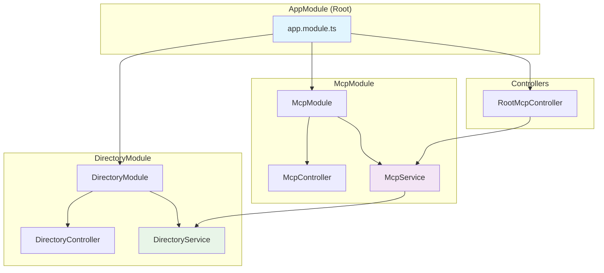

# Architecture

This document describes the NestJS architecture of the Simple MCP Server — its module structure, entry points, and design patterns.

---

## Table of Contents

1. [System Overview](#system-overview)
2. [Module Structure](#module-structure)
3. [Entry Points](#entry-points)
4. [Design Patterns](#design-patterns)

---

## System Overview



The application follows a clean NestJS module hierarchy:
- **AppModule** composes all feature modules
- **DirectoryModule** encapsulates directory listing logic
- **McpModule** encapsulates MCP protocol and HTTP transport
- **RootMcpController** handles the `/mcp` HTTP endpoints at the application root

---

## Module Structure

### 1. AppModule (`src/app.module.ts`)

Root module that bootstraps the entire application.

```typescript
@Module({
  imports: [DirectoryModule, McpModule],  // Feature modules
  controllers: [RootMcpController],       // HTTP MCP endpoints
  providers: [],                          // Global services
})
export class AppModule {}
```

**Key Responsibilities**:
- Module composition — combines all feature modules
- HTTP routing — configures root-level MCP endpoints
- Bootstrap — entry point for both stdio and HTTP servers

---

### 2. DirectoryModule (`src/directory/`)

Encapsulates all directory-related functionality.

```typescript
@Module({
  controllers: [DirectoryController],  // HTTP REST endpoints
  providers: [DirectoryService],       // Business logic
  exports: [DirectoryService],         // Available to other modules
})
export class DirectoryModule {}
```

#### DirectoryService (`src/directory/directory.service.ts`)

Core business logic for directory operations.

```typescript
@Injectable()
export class DirectoryService {
  async listDirectory(path: string): Promise<string> {
    // 1. Path sanitization and corruption handling
    let cleanPath = this.sanitizePath(path);

    // 2. Git Bash execution (cross-platform Unix tools)
    const gitBashPath = 'C:\\Program Files\\Git\\bin\\bash.exe';
    const command = `"${gitBashPath}" -c "ls -la '${cleanPath}'"`;

    // 3. Fallback to PowerShell if Git Bash fails
    return this.executeWithFallback(command, path);
  }
}
```

**Design rationale**:
- Path sanitization handles MCPHost path corruption issues
- Git Bash provides consistent output format across platforms
- PowerShell fallback ensures operation without Git Bash
- Clean separation from transport layer makes the service independently testable

#### DirectoryController (`src/directory/directory.controller.ts`)

HTTP REST interface for testing outside the MCP protocol.

```typescript
@Controller('directory')
export class DirectoryController {
  @Get('list')
  async list(@Query('path') path?: string) {
    return this.directoryService.listDirectory(path || '.');
  }
}
```

**Educational value**: Allows testing the directory service via `GET /directory/list?path=...` without needing MCPHost or the full MCP protocol.

---

### 3. McpModule (`src/mcp/`)

Handles MCP protocol implementation and HTTP transport.

```typescript
@Module({
  imports: [DirectoryModule],      // Depends on directory functionality
  controllers: [McpController],    // MCP-specific HTTP routes
  providers: [McpService],         // MCP protocol logic
  exports: [McpService],           // Available to root controller
})
export class McpModule {}
```

#### McpService (`src/mcp/mcp.service.ts`)

StreamableHTTP transport and session management.

```typescript
@Injectable()
export class McpService implements OnModuleDestroy {
  private transports: { [sessionId: string]: StreamableHTTPServerTransport } = {};

  async handleRequest(req: Request, res: Response, body?: any, sessionId?: string) {
    // 1. Session management — reuse or create new
    let transport = this.getOrCreateTransport(sessionId, body);

    // 2. Tool registration using modern MCP SDK
    server.registerTool('list_directory', schema, handler);

    // 3. Request delegation to transport
    await transport.handleRequest(req, res, body);
  }
}
```

**Key features**:
- UUID-based session tracking for concurrent clients
- Transport reuse for efficient connection pooling
- Proper lifecycle management (`OnModuleDestroy`)
- Modern MCP SDK with `server.registerTool()` API

#### RootMcpController (`src/root-mcp.controller.ts`)

HTTP endpoints for the MCP protocol at application root.

```typescript
@Controller()
export class RootMcpController {
  @Post('mcp')   // POST /mcp — primary MCP endpoint (tool calls, initialization)
  @Get('mcp')    // GET /mcp — tool discovery, health check
  @Delete('mcp') // DELETE /mcp — session cleanup
  async handleMcp(@Req() req, @Res() res, @Body() body, @Headers('mcp-session-id') sessionId) {
    await this.mcpService.handleRequest(req, res, body, sessionId);
  }
}
```

---

## Entry Points

### Stdio Entry Point (`src/main.ts`)

Creates a NestJS application context (no HTTP server) and connects an MCP server via Stdio transport.

```typescript
async function bootstrap() {
  // 1. Application context (no HTTP server needed)
  const app = await NestFactory.createApplicationContext(AppModule);

  // 2. Services via dependency injection
  const directoryService = app.get(DirectoryService);

  // 3. MCP server with stdio transport
  const server = new Server({ name: 'simple-directory-mcp-server' });
  const transport = new StdioServerTransport();

  // 4. Register tools and connect
  await server.connect(transport);
}
```

### HTTP Entry Point (`src/main-http.ts`)

Creates a full NestJS HTTP application with CORS configured for MCP compatibility.

```typescript
async function bootstrap() {
  // 1. Full NestJS HTTP application
  const app = await NestFactory.create(AppModule);

  // 2. CORS with MCP session header exposed
  app.use(cors({ exposedHeaders: ['Mcp-Session-Id'] }));

  // 3. HTTP server on all interfaces
  await app.listen(3000, '0.0.0.0');
}
```

---

## Design Patterns

### 1. Dependency Injection

NestJS's DI container automatically injects `DirectoryService` into `McpService`:

```typescript
constructor(private readonly directoryService: DirectoryService) {}
```

No manual instantiation. Testable by swapping implementations.

### 2. Module Encapsulation

Each module owns its domain. Modules export only what other modules need:
- `DirectoryModule` exports `DirectoryService` → consumed by `McpModule`
- `McpModule` exports `McpService` → consumed by `RootMcpController`

### 3. Single Responsibility

| Component | Responsibility |
|-----------|---------------|
| `DirectoryService` | Business logic — executing filesystem commands |
| `McpService` | Protocol handling — MCP transport and session management |
| `DirectoryController` | HTTP routing — REST interface for direct testing |
| `RootMcpController` | HTTP routing — MCP protocol endpoints |

### 4. Scalability

- New tools are added as new modules and services
- Each module can independently evolve
- Horizontal scaling works because `McpService` stores sessions in memory (per-instance)

---

*See also: [MCP Protocol Guide](mcp-protocol-guide.md) | [Design Decisions](design-decisions.md) | [Dependencies and Setup](dependencies-and-setup.md)*
