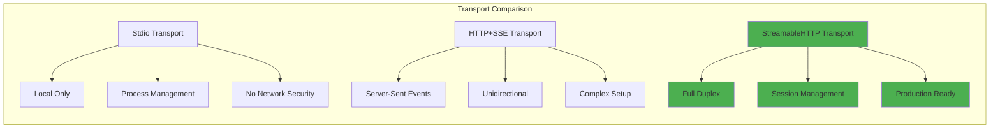

# Design Decisions

This document records the key architectural decisions made during the development of the Simple MCP Server, using an Architecture Decision Record (ADR) format.

---

## Table of Contents

- [Design Decisions](#design-decisions)
  - [Table of Contents](#table-of-contents)
  - [ADR-1: NestJS over Express/Fastify/Koa](#adr-1-nestjs-over-expressfastifykoa)
  - [ADR-2: StreamableHTTP over SSE/Stdio](#adr-2-streamablehttp-over-ssestdio)
  - [ADR-3: Llama 3.2:1b Model Selection](#adr-3-llama-321b-model-selection)
  - [ADR-4: MCPHost over Custom Client / Claude Desktop](#adr-4-mcphost-over-custom-client--claude-desktop)
  - [ADR-5: Git Bash for Directory Listing](#adr-5-git-bash-for-directory-listing)
  - [Academic Foundations \& References](#academic-foundations--references)
    - [Key Academic Sources](#key-academic-sources)
    - [Key Principles from Literature](#key-principles-from-literature)

---

## ADR-1: NestJS over Express/Fastify/Koa

**Status**: Accepted

**Context**: The project needed a Node.js server framework to host MCP protocol endpoints and a REST interface for direct testing.

**Decision**: Use NestJS.

**Rationale**:
- **Dependency Injection**: Built-in IoC container enables modular, testable architecture
- **Decorator-based**: TypeScript-first development with clean syntax
- **Enterprise Patterns**: Proven patterns for scalable applications (modules, services, controllers)
- **Middleware Ecosystem**: Rich ecosystem for cross-cutting concerns (CORS, logging, validation)

**Alternatives Considered**:

| Framework | Pros | Cons |
|-----------|------|------|
| Express | Minimal, flexible | No DI, manual structure |
| Fastify | High performance | Smaller ecosystem, less TypeScript native |
| Koa | Lightweight, async/await | Very minimal, no conventions |
| **NestJS** | DI, structure, TypeScript | Slight overhead for simple servers |

**Consequences**: The module structure (AppModule → DirectoryModule / McpModule) makes it easy to add new tools as independent modules.

---

## ADR-2: StreamableHTTP over SSE/Stdio

**Status**: Accepted

**Context**: MCP supports multiple transport protocols. The project needed a transport that enables production deployment on distributed infrastructure.

**Decision**: Implement both Stdio (for local development) and StreamableHTTP (for production/remote).

**Rationale for StreamableHTTP**:
- **Full-duplex communication**: Bidirectional streaming capabilities
- **Session management**: Built-in UUID-based session tracking
- **Production readiness**: Designed for enterprise deployment (Docker, Kubernetes, ECS)
- **Multiple concurrent clients**: Unlike Stdio (single-process)

**Transport Comparison**:

| Feature | Stdio | HTTP+SSE | StreamableHTTP |
|---------|-------|----------|----------------|
| Clients | Single | Multiple | Multiple |
| Network | No | Yes | Yes |
| Full-duplex | Yes | No | Yes |
| Session Mgmt | Process | Manual | Built-in UUID |
| Production | No | Partial | Yes |

---

## ADR-3: Llama 3.2:1b Model Selection

**Status**: Accepted

**Context**: An LLM that can reliably perform MCP tool calling was required, with constraints on local resource usage.

**Decision**: Use Llama 3.2:1b via Ollama.

**Rationale**:
- **Tool calling support**: Native function calling with JSON schema understanding
- **Resource efficiency**: Runs on typical developer hardware (low CPU/RAM)
- **Context window**: 4K–8K tokens — sufficient for complex tool interactions
- **Reliable parameter generation**: Consistent extraction of paths from natural language

**Model Comparison**:

| Model | Tool Calling | Context | Resource Usage | MCP Compatibility |
|-------|-------------|---------|----------------|-------------------|
| **Llama 3.2:1b** | Excellent | 4K-8K | Low | Native |
| GPT-3.5-turbo | Good | 4K | Medium | Limited |
| Claude-3-haiku | Excellent | 200K | High | Native |
| Mistral-7B | Limited | 8K | Medium | No |

**Consequences**: The model runs fully locally via Ollama — no API fees, no data sent to external services, works offline.

---

## ADR-4: MCPHost over Custom Client / Claude Desktop

**Status**: Accepted

**Context**: A client was needed to connect Ollama/Llama to the MCP server. Options included building a custom client, using Claude Desktop, or using MCPHost.

**Decision**: Use MCPHost (Go-based open-source MCP client).

**Rationale**:
- **Simplified configuration**: Single YAML file vs complex JSON system configs
- **Ollama native integration**: First-class support for Ollama models
- **Remote server support**: Full StreamableHTTP support for production scenarios
- **Debug mode**: Clear `--debug` flag for protocol-level visibility
- **Multi-provider**: Easily switch between Ollama, OpenAI, Claude, etc.

**MCPHost vs Alternatives**:

| Feature | MCPHost | Custom Client | Claude Desktop |
|---------|---------|---------------|----------------|
| Go Performance | Fast | Varies | Optimized |
| Ollama Integration | Native | Manual | No |
| Remote Servers | Full | Depends | Limited |
| Configuration | YAML-based | Custom | JSON |
| Debug Mode | Yes | Manual | No |
| Open Source | Yes | Yes | No |

---

## ADR-5: Git Bash for Directory Listing

**Status**: Accepted

**Context**: The `list_directory` tool needed to execute filesystem commands cross-platform. On Windows, native `dir` output format differs from Unix `ls`.

**Decision**: Use Git Bash (`C:\Program Files\Git\bin\bash.exe`) to execute `ls -la` on Windows, with PowerShell as a fallback.

**Rationale**:
- **Consistent output**: `ls -la` format is identical on Windows (via Git Bash) and Linux/macOS
- **MCPHost path handling**: MCPHost sends paths that Git Bash handles reliably
- **Wide availability**: Git is required anyway (for cloning the project) — no extra dependency
- **Fallback safety**: PowerShell backup ensures operation even without Git Bash

**Alternatives Considered**:
- Native `cmd /c dir` — different output format, harder for LLM to parse
- Node.js `fs.readdir` — no detailed ls-style metadata
- Cross-platform `ls` via npm package — extra dependency

---

## Academic Foundations & References

The following academic research informed and validated our architectural decisions:

### Key Academic Sources

1. **"AgentX: Towards Orchestrating Robust Agentic Workflow Patterns with FaaS-hosted MCP Services"** (arXiv:2509.07595)
   - Demonstrates how MCP enables robust multi-agent systems
   - Validates the importance of standardized tool interfaces
   - Shows performance benefits of distributed MCP deployments

2. **"Paper2Agent: Reimagining Research Papers As Interactive and Reliable AI Agents"** (arXiv:2509.06917)
   - Utilizes MCP servers for systematic paper analysis
   - Demonstrates the protocol's versatility in academic applications
   - Validates the iterative testing approach used in our development

3. **"Code2MCP: A Multi-Agent Framework for Automated Transformation of Code Repositories into Model Context Protocol Services"** (arXiv:2509.05941)
   - Addresses the N×M integration problem that MCP solves
   - Provides theoretical foundation for our architectural decisions
   - Validates the importance of standardized interfaces

### Key Principles from Literature

**Protocol Standardization Benefits**:
- Reduces integration complexity from O(N×M) to O(N+M)
- Enables ecosystem-wide tool sharing
- Facilitates security and compliance standardization

**Distributed Systems Principles Applied**:
- **CAP Theorem**: Session-based state management (consistency) + load balancer health checks (availability) + graceful degradation (partition tolerance)
- **Microservices Patterns**: Service discovery via load balancer, circuit breakers via MCPHost timeout handling, bulkhead isolation (separate EC2/ECS concerns)

---

*See also: [Architecture](architecture.md) | [MCP Protocol Guide](mcp-protocol-guide.md) | [Development Process](development-process.md)*
