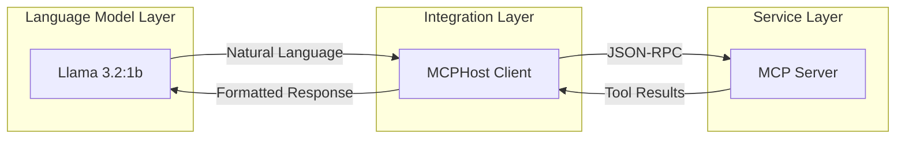
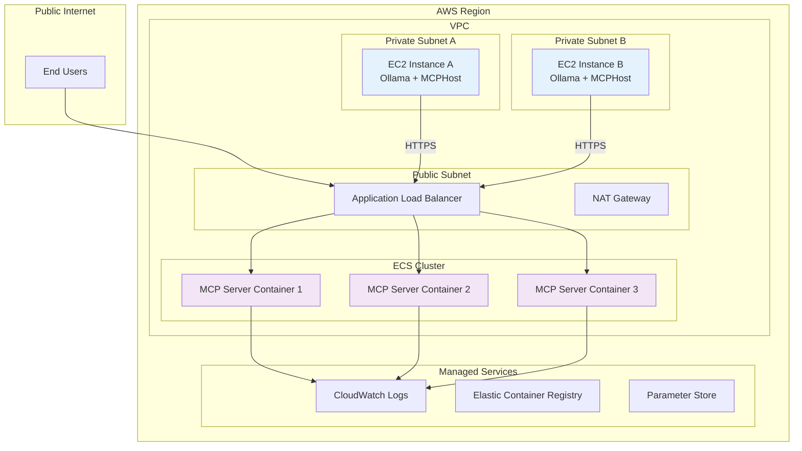
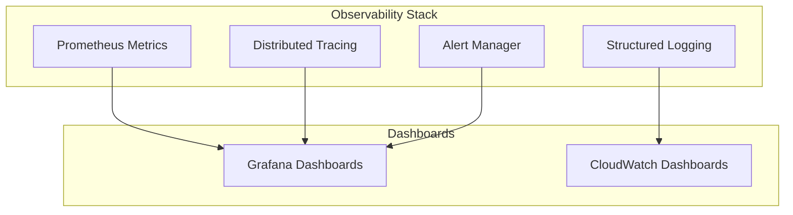

# Development Process

This document chronicles the journey from a simple local stdio MCP server to a distributed StreamableHTTP deployment — the challenges encountered, the decisions made, and the production architecture that emerged.

---

## Table of Contents

1. [Development Timeline](#development-timeline)
2. [Development Challenges & Solutions](#development-challenges--solutions)
3. [MCPHost Integration Strategy](#mcphost-integration-strategy)
4. [Production Deployment Architecture](#production-deployment-architecture)
5. [Future Considerations](#future-considerations)

---

## Development Timeline

The project was built over 8 days in September 2025 across 5 branches by a single author.

| Phase | Branch | Period | Summary |
|-------|--------|--------|---------|
| Foundation | `feature/stedio-transport` | Sep 9 | Initial NestJS scaffold, stdio MCP server working with MCPHost and Llama 3.2:1b, Windows/Linux automation scripts added |
| StreamableHTTP | `feature/http-streamable-transport` | Sep 11 | Migrated to HTTP transport, session management, full educational documentation written |
| Testing Infrastructure | `feature/postman-collection` | Sep 15 | Postman and Bruno API collections added for testing the full MCP HTTP workflow |
| Documentation | `docs/improoving` | Sep 17+ | Documentation reorganized into focused `docs/` files, root README simplified |

---

## Development Challenges & Solutions

### Challenge 1: Host Header Validation

**Problem**: The StreamableHTTP transport includes DNS rebinding protection that rejected requests with certain Host headers.

**Error Manifestation**:
```bash
Error: Invalid Host header: localhost:3000
```

**Root Cause**: The StreamableHTTP transport validates the Host header against a whitelist to prevent DNS rebinding attacks.

**Solution**:
```typescript
const transport = new StreamableHTTPServerTransport({
  // Disabled for local development — enable in production
  enableDnsRebindingProtection: false,
  // Production alternative:
  // allowedHosts: ['your-production-domain.com'],
});

// Additional Express middleware for development
app.use((req, res, next) => {
  const allowedHosts = ['127.0.0.1:3000', 'localhost:3000', '0.0.0.0:3000'];
  const hostHeader = req.get('Host');
  if (hostHeader && !allowedHosts.includes(hostHeader)) {
    console.log(`Warning: Unusual host header: ${hostHeader}`);
  }
  next();
});
```

**Production Considerations**: Enable DNS rebinding protection, configure `allowedHosts` with actual domain names, and implement proper certificate validation.

---

### Challenge 2: Tool Schema Validation

**Problem**: Tool parameter schemas required specific Zod object structure for proper validation.

**Initial (Incorrect) Implementation**:
```typescript
inputSchema: {
  type: 'object',
  properties: {
    path: { type: 'string' }
  }
}
```

**Corrected Implementation**:
```typescript
const listDirectorySchema = z.object({
  path: z.string().min(1, 'Path cannot be empty'),
});

// Tool registration with proper schema
{
  name: 'list_directory',
  description: 'List contents of a directory using Git Bash ls command',
  inputSchema: zodToJsonSchema(listDirectorySchema),
}
```

**Key Learning**: MCP SDK expects JSON Schema format, not Zod objects — use `zodToJsonSchema` for conversion.

---

### Challenge 3: CORS Configuration

**Problem**: Cross-origin requests from MCPHost were blocked by default CORS policy.

**Solution**:
```typescript
app.use(cors({
  origin: '*', // Configure restrictively for production
  exposedHeaders: ['Mcp-Session-Id'],
  allowedHeaders: ['Content-Type', 'mcp-session-id', 'Host'],
  credentials: true,
  methods: ['GET', 'POST', 'PUT', 'DELETE', 'OPTIONS'],
}));
```

**Production Security**: Replace `origin: '*'` with specific domains, implement authentication headers, and use HTTPS.

---

### Challenge 4: Session State Management

**Problem**: StreamableHTTP requires explicit session management for stateful connections.

**Solution Architecture**:
```typescript
export class McpService {
  private transports: { [sessionId: string]: StreamableHTTPServerTransport } = {};

  async handleRequest(req: Request, res: Response, body?: any, sessionId?: string) {
    let transport: StreamableHTTPServerTransport;

    if (sessionId && this.transports[sessionId]) {
      // Reuse existing session
      transport = this.transports[sessionId];
    } else if (!sessionId && isInitializeRequest(body)) {
      // Create new session
      transport = new StreamableHTTPServerTransport({
        sessionIdGenerator: () => randomUUID(),
        onsessioninitialized: (newSessionId) => {
          this.transports[newSessionId] = transport;
        },
      });
    }

    await transport.handleRequest(req, res, body);
  }
}
```

---

## MCPHost Integration Strategy

MCPHost bridges language models and MCP servers, providing protocol translation, session management, error handling, and configuration management.



### Local Development Configuration
```yaml
# .mcphost-http.yml
model: "ollama:llama3.2:1b"
mcpServers:
  simple-directory-server:
    type: "remote"
    url: "http://localhost:3000/mcp"
max-tokens: 2048
temperature: 0.7
```

### Production Configuration
```yaml
model: "ollama:llama3.2:1b"
mcpServers:
  simple-directory-server:
    type: "remote"
    url: "https://mcp-server.your-domain.com/mcp"
    headers: ["Authorization: Bearer ${MCP_TOKEN}"]
max-tokens: 2048
temperature: 0.7
```

---

## Production Deployment Architecture

For enterprise-grade deployment, the recommended architecture separates concerns across multiple AWS services:



### Component Responsibilities

**EC2 Instances (Ollama + MCPHost)** — Host the language model and MCP client
- Instance Type: c5.2xlarge or better (CPU-optimized)
- Security Groups: Outbound HTTPS (443) only
- IAM Role: Minimal permissions for CloudWatch

**ECS Containers (MCP Server)** — Scalable MCP server deployment
- Task Definition: Fargate with 1 vCPU, 2GB RAM
- Auto-scaling based on CPU/memory metrics
- Health checks via ALB Target Group

**Dockerfile**:
```dockerfile
FROM node:18-alpine

WORKDIR /app
COPY package*.json ./
RUN npm ci --only=production
COPY dist/ ./dist/

HEALTHCHECK --interval=30s --timeout=3s --start-period=10s \
  CMD curl -f http://localhost:3000/health || exit 1

USER node
EXPOSE 3000
CMD ["node", "dist/main-http.js"]
```

### Security Considerations

- **VPC Isolation**: Private subnets for compute resources
- **Authentication**: JWT tokens for MCP access
- **Rate Limiting**: Prevent abuse of MCP endpoints
- **Input Validation**: Comprehensive parameter sanitization
- **Secrets Management**: AWS Parameter Store / Secrets Manager

### Scalability Patterns

**Scaling Metrics**:
- EC2 Scaling: CPU utilization > 70%
- ECS Scaling: Memory utilization > 80%
- Custom Metrics: MCP request queue depth

---

## Future Considerations

### Emerging Transport Protocols
- **WebSocket Transport**: Real-time bidirectional communication
- **gRPC Transport**: High-performance binary protocol
- **GraphQL Transport**: Query-based tool invocation

### Observability Stack


**Key Metrics**: Tool invocation latency, session establishment time, error rates by tool type, resource utilization patterns.

### Security Enhancements
- Zero Trust Architecture: Mutual TLS between all components
- Tool Sandboxing: Containerized tool execution
- Audit Logging: Comprehensive tool usage tracking

---

*See also: [Design Decisions](design-decisions.md) | [MCP Protocol Guide](mcp-protocol-guide.md) | [Architecture](architecture.md)*
