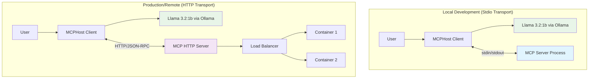
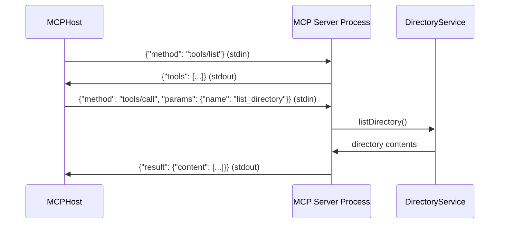
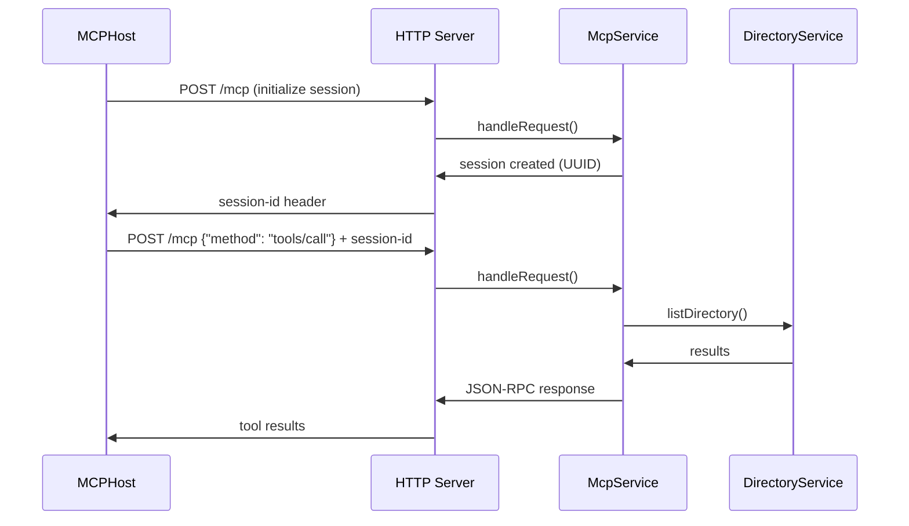

# MCP Protocol Guide

This document covers the Model Context Protocol (MCP) — what it is, how it works, and how this project implements both Stdio and StreamableHTTP transports.

---

## Table of Contents

1. [What is MCP?](#what-is-mcp)
2. [Key Components](#key-components)
3. [Stdio Transport](#stdio-transport)
4. [StreamableHTTP Transport](#streamablehttp-transport)
5. [Transport Comparison](#transport-comparison)
6. [Complete Request Flow](#complete-request-flow)
7. [JSON-RPC Message Examples](#json-rpc-message-examples)
8. [Transport Protocol Migration Journey](#transport-protocol-migration-journey)

---

## What is MCP?

The **Model Context Protocol (MCP)** is a standard that enables Large Language Models to:
- Access external tools and services safely
- Maintain context across interactions
- Execute commands with proper security boundaries
- Communicate with various systems and APIs
- Support multiple transports — both local and remote connections

MCP reduces AI-to-tool integration complexity from O(N×M) to O(N+M) by providing a standardized interface that any LLM host can use with any MCP server.

---

## Key Components



### 1. Host (MCPHost)
- Manages the AI model (Ollama / Llama 3.2:1b)
- Handles user conversations
- Discovers and calls MCP tools
- Formats responses back to users
- Supports both local and remote MCP servers

### 2. Server (Our NestJS App)
- Implements the MCP protocol
- Exposes tools via JSON-RPC
- Handles the actual system operations
- Returns results to the host
- Dual transport support: Stdio + StreamableHTTP

### 3. Transport Layer
- **Stdio**: Local process communication (development)
- **StreamableHTTP**: Remote server communication (production)
- All messages use JSON-RPC format
- Bidirectional data flow

---

## Stdio Transport

Stdio transport is used for local development. The MCP server reads from `stdin` and writes to `stdout`, and the MCP host writes to the server's `stdin` and reads from its `stdout`.

**Best for**: Local development, single-user scenarios, simple testing.



**Server-side implementation** (`src/main.ts`):
```typescript
const transport = new StdioServerTransport();
await server.connect(transport);
// Server listens on stdin, responds on stdout
```

**MCPHost configuration** (`.mcphost.yml`):
```yaml
mcpServers:
  simple-directory-server:
    type: "local"
    command: ["node", "dist/main.js"]
    # MCPHost connects via stdin/stdout
```

---

## StreamableHTTP Transport

StreamableHTTP transport enables production/remote deployment. It uses HTTP with session management for full-duplex, multi-client communication.

**Best for**: Production deployments, distributed systems, multiple concurrent clients.



**Server-side implementation** (`src/mcp/mcp.service.ts`):
```typescript
const transport = new StreamableHTTPServerTransport({
  sessionIdGenerator: () => randomUUID(),
  onsessioninitialized: (sessionId) => {
    this.transports[sessionId] = transport;
  }
});
```

**MCPHost configuration** (`.mcphost-http.yml`):
```yaml
mcpServers:
  simple-directory-server:
    type: "remote"
    url: "http://localhost:3000/mcp"
```

---

## Transport Comparison

| Feature | Stdio Transport | StreamableHTTP Transport |
|---------|----------------|--------------------------|
| **Use Case** | Local development | Production/Remote |
| **Clients** | Single client | Multiple concurrent |
| **Network** | No network needed | HTTP over network |
| **Scalability** | Limited | Highly scalable |
| **Session Management** | Process-based | UUID-based sessions |
| **Security** | Process isolation | HTTP + authentication |
| **Debugging** | Direct process logs | HTTP logs + monitoring |
| **Deployment** | Local only | Docker, Kubernetes, Cloud |

---

## Complete Request Flow

1. **User Input** → MCPHost receives natural language
2. **AI Processing** → Llama 3.2:1b determines it needs a tool
3. **Tool Discovery** → MCPHost asks our server for available tools
4. **Tool Selection** → AI chooses `list_directory` tool
5. **Parameter Extraction** → AI determines the path parameter from context
6. **MCP Call** → MCPHost sends JSON-RPC request (via stdin or HTTP)
7. **Server Processing** → `DirectoryService` handles the request
8. **System Command** → Service executes Git Bash `ls` command
9. **Response Formatting** → Service formats output for MCP
10. **Return to Host** → JSON-RPC response returned to MCPHost
11. **AI Integration** → MCPHost gives result to AI model
12. **User Response** → AI formats final answer for user

---

## JSON-RPC Message Examples

### Tool Discovery Request
```json
{
  "jsonrpc": "2.0",
  "id": 1,
  "method": "tools/list"
}
```

### Tool Discovery Response
```json
{
  "jsonrpc": "2.0",
  "id": 1,
  "result": {
    "tools": [{
      "name": "list_directory",
      "description": "List contents of a directory using Git Bash ls command",
      "inputSchema": {
        "type": "object",
        "properties": {
          "path": {
            "type": "string",
            "description": "Directory path to list (use forward slashes, even on Windows)"
          }
        },
        "required": ["path"]
      }
    }]
  }
}
```

### Tool Execution Request
```json
{
  "jsonrpc": "2.0",
  "id": 2,
  "method": "tools/call",
  "params": {
    "name": "list_directory",
    "arguments": {
      "path": "C:/Users/lemys.lopez/projects"
    }
  }
}
```

---

## Transport Protocol Migration Journey

### Phase 1: Stdio Implementation (Baseline)

The original implementation used stdio transport for local-only communication:

```typescript
// Original stdio implementation
const transport = new StdioServerTransport();
await server.connect(transport);
```

**Characteristics**:
- Process-to-process communication via stdin/stdout
- Zero network configuration
- Automatic process lifecycle management
- Limited to single-client scenarios

### Phase 2: StreamableHTTP Implementation

Migration introduced UUID-based session tracking, concurrent client support, and HTTP-standard endpoints:

```typescript
// StreamableHTTP implementation
const transport = new StreamableHTTPServerTransport({
  sessionIdGenerator: () => randomUUID(),
  onsessioninitialized: (sessionId) => {
    this.transports[sessionId] = transport;
  },
  enableDnsRebindingProtection: false, // For local development
});
```

See [Development Process](development-process.md) for the complete list of challenges and solutions encountered during migration.

---

*See also: [Architecture](architecture.md) | [Design Decisions](design-decisions.md) | [Testing Guide](testing-guide.md)*
