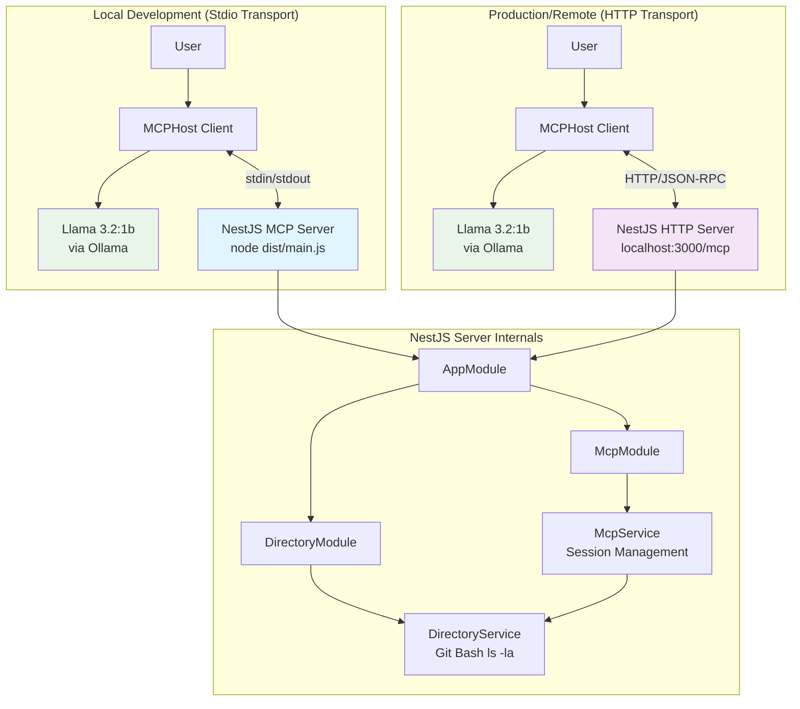

# Project Overview

## Abstract

The Simple MCP Server teaches how to build a **distributed, production-grade MCP server** — one where the AI client and the tool server run as independent processes and communicate over a network. Built with NestJS and TypeScript, it implements a working MCP server that exposes a `list_directory` tool, giving a local Llama 3.2:1b model (via Ollama) the ability to browse the host filesystem on behalf of a user.

The project takes you through the full journey: starting with a local stdio server where client and server share a process, then migrating to the StreamableHTTP transport where they are fully decoupled. Along the way it addresses the real distributed-systems challenges that arise — session management across stateless HTTP requests, CORS, DNS rebinding protection, and schema-driven tool contracts. All challenges and their solutions are documented alongside the code.

Every architectural choice (NestJS modules, StreamableHTTP transport, MCPHost client, Llama 3.2:1b model) was made to maximize educational clarity while reflecting real production patterns. The tool exposed (`list_directory`) is intentionally simple so the focus stays on the protocol and architecture — the same patterns apply to any tool you build on top. The reasoning behind each choice is documented in the [Design Decisions](design-decisions.md) document.

---

## Target Audience

- **Students and developers** learning how AI systems call external tools via MCP
- **Backend engineers** building or evaluating distributed MCP server deployments
- **Educators** looking for a concrete, working example to teach MCP and distributed architecture concepts
- **Engineers** evaluating NestJS for production MCP server implementation
- **Anyone** who wants to run a local AI with tool access using only open-source components (Ollama + MCPHost)

No prior MCP experience is required. Familiarity with Node.js/TypeScript and basic HTTP concepts is helpful.

---

## What You Will Learn

By working through this project, you will understand:

**Distributed MCP Architecture**
- How to decouple an AI client from an MCP server using the StreamableHTTP transport
- Session management across stateless HTTP requests
- Security boundaries: why the model only sees what the tool returns

**MCP Protocol Fundamentals**
- How the JSON-RPC based Model Context Protocol works
- The roles of Host, Server, and Transport in an MCP system
- How an LLM discovers and calls tools at runtime

**Transport Modes**
- Stdio: client and server in the same process (local development)
- StreamableHTTP: fully decoupled client and server over HTTP (production)
- When and why to migrate from one to the other

**NestJS Enterprise Patterns**
- Module composition and dependency injection
- Separation of business logic from transport protocol
- Clean service → controller → module boundaries

**Production Architecture**
- AWS deployment patterns (EC2 + ECS + ALB)
- Serving multiple concurrent MCP clients with session isolation
- Security considerations (CORS, host validation, auth headers)

---

## High-Level Architecture

The system has three layers: the **MCPHost client** (manages the LLM and user interaction), the **MCP server** (NestJS app exposing tools), and the **business logic** (`DirectoryService` executing filesystem commands). The transport layer (Stdio or StreamableHTTP) sits between host and server and is swappable without changing business logic.

---

## Documentation Map

| Document | Description |
|----------|-------------|
| [Architecture](architecture.md) | NestJS module structure, entry points, design patterns |
| [MCP Protocol Guide](mcp-protocol-guide.md) | Protocol concepts, transports, request flow, JSON-RPC examples |
| [Design Decisions](design-decisions.md) | ADRs for framework, transport, model, and tool choices |
| [Development Process](development-process.md) | Challenges solved, production AWS architecture, future roadmap |
| [Dependencies and Setup](dependencies-and-setup.md) | All dependencies, cross-platform installation instructions |
| [Configuration Reference](configuration-reference.md) | Annotated config files and environment variables |
| [Testing Guide](testing-guide.md) | Quick start, stdio/HTTP testing, Bruno/Postman, debugging, FAQ |

---

*See also the root [README](../README.md) for quick-start instructions.*
