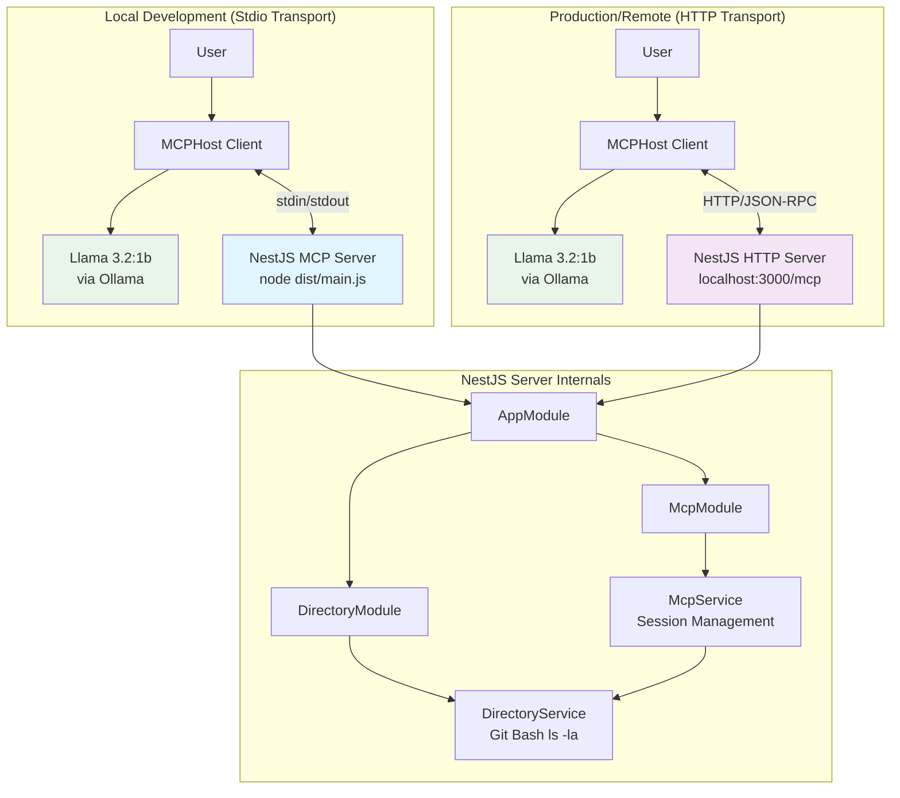

# Project Overview

## Abstract

The Simple MCP Server is a focused educational project demonstrating how Large Language Models (LLMs) interact with external systems through the **Model Context Protocol (MCP)**. Built with NestJS and TypeScript, the project implements a working MCP server that exposes a `list_directory` tool, allowing an AI model (Llama 3.2:1b running on Ollama) to browse the filesystem on behalf of a user. By showing both local stdio transport and remote StreamableHTTP transport in the same codebase, the project covers the full spectrum from simple local development to production-ready distributed deployment.

The project chronicles a realistic development journey: starting from a minimal stdio-based server, migrating to a remote HTTP transport, and addressing real-world integration challenges such as session management, CORS configuration, DNS rebinding protection, and tool schema validation. All challenges and their solutions are documented alongside the code, making this a practical reference rather than a toy example.

This is not a production system — it is a teaching resource. Every architectural choice (NestJS modules, StreamableHTTP transport, MCPHost client, Llama 3.2:1b model) was made to maximize educational clarity, and the reasoning behind each choice is documented in the [Design Decisions](design-decisions.md) document.

---

## Target Audience

- **Students and developers** learning how AI systems call external tools
- **Backend engineers** exploring the Model Context Protocol for the first time
- **Educators** looking for a concrete, working example to teach MCP concepts
- **Engineers** evaluating NestJS for MCP server implementation
- **Anyone** who wants to run a local AI with tool access using only open-source components (Ollama + MCPHost)

No prior MCP experience is required. Familiarity with Node.js/TypeScript and basic HTTP concepts is helpful.

---

## What You Will Learn

By working through this project, you will understand:

**MCP Protocol Fundamentals**
- How the JSON-RPC based Model Context Protocol works
- The roles of Host, Server, and Transport in an MCP system
- How an LLM discovers and calls tools at runtime

**Dual Transport Modes**
- Stdio transport: inter-process communication for local development
- StreamableHTTP transport: session-managed HTTP for production/remote use
- When and why to choose one over the other

**NestJS Enterprise Patterns**
- Module composition and dependency injection
- Separation of business logic from transport protocol
- Clean service → controller → module boundaries

**Local AI Integration**
- Running Llama 3.2:1b fully locally via Ollama
- Configuring MCPHost to connect an LLM to an MCP server
- Tuning model parameters and system prompts

**Production Architecture**
- AWS deployment patterns (EC2 + ECS + ALB)
- Session management for concurrent clients
- Security considerations (CORS, host validation, auth headers)

---

## High-Level Architecture

The system has three layers: the **MCPHost client** (manages the LLM and user interaction), the **MCP server** (NestJS app exposing tools), and the **business logic** (`DirectoryService` executing filesystem commands). The transport layer (Stdio or StreamableHTTP) sits between host and server and is swappable without changing business logic.

---

## Documentation Map

| Document | Description |
|----------|-------------|
| [Architecture](architecture.md) | NestJS module structure, entry points, design patterns |
| [MCP Protocol Guide](mcp-protocol-guide.md) | Protocol concepts, transports, request flow, JSON-RPC examples |
| [Design Decisions](design-decisions.md) | ADRs for framework, transport, model, and tool choices |
| [Development Process](development-process.md) | Challenges solved, production AWS architecture, future roadmap |

| [Dependencies and Setup](dependencies-and-setup.md) | All dependencies, cross-platform installation instructions |
| [Configuration Reference](configuration-reference.md) | Annotated config files and environment variables |
| [Testing Guide](testing-guide.md) | Quick start, stdio/HTTP testing, Bruno/Postman, debugging, FAQ |

---

*See also the root [README](../README.md) for quick-start instructions.*
