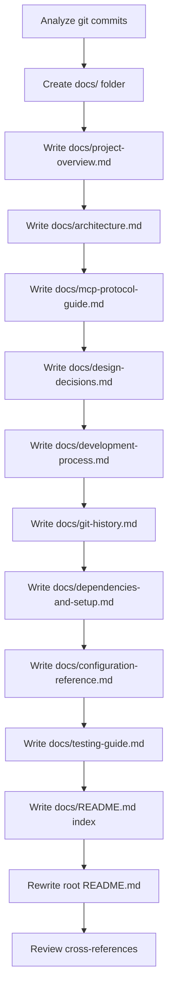

# Documentation Reorganization Plan

## Objective

Reorganize and improve the project documentation by creating a `docs/` folder with focused, low-cognitive-load files while reducing the main `README.md` to a concise entry point.

---

## Current State Analysis

### Problems with Current Documentation

1. **`README.md` is ~1,494 lines** — overwhelming cognitive load; mixes abstract, architecture deep-dives, setup guides for 3 OSes, code examples, educational exercises, troubleshooting, and project structure all in one file.
2. **`DEVELOPMENT_PROCESS.md` is ~869 lines** — thorough but redundant with README in many sections (transport comparison, architecture diagrams, MCPHost config).
3. **No `docs/` folder** — all documentation lives at root level with no clear hierarchy.
4. **No dependency manifest documentation** — versions and install steps are scattered throughout README sections.
5. **No git history analysis** — the project evolution story is only told through DEVELOPMENT_PROCESS.md narrative, not actual commit data.
6. **Duplicated content** — JSON-RPC examples appear twice in README, troubleshooting appears twice, transport comparisons in both files.

### What Works Well

- Mermaid diagrams are excellent and should be preserved/enhanced.
- The educational tone is valuable and should be maintained.
- Bruno and Postman collections exist for testing.
- MCPHost config files are well-documented inline.

---

## Proposed `docs/` Structure

```
docs/
├── README.md                      # Index/table of contents for docs
├── project-overview.md            # What, why, and for whom
├── architecture.md                # NestJS modules, transport modes, data flow
├── mcp-protocol-guide.md          # MCP protocol deep-dive with JSON-RPC examples
├── design-decisions.md            # ADRs: why NestJS, why StreamableHTTP, why Llama 3.2:1b
├── development-process.md         # Refined journey from stdio to HTTP transport
├── git-history.md                 # Commit-based project creation timeline
├── dependencies-and-setup.md      # Full deps list, versions, cross-platform install
├── configuration-reference.md     # All config files explained
└── testing-guide.md               # Bruno, Postman, manual testing, debugging
```

---

## Detailed File Plans

### 1. `docs/README.md` — Documentation Index

A lightweight table of contents linking to all other docs with one-line descriptions.

### 2. `docs/project-overview.md`

Content from:
- README sections: "Educational Overview", "What You'll Learn", "Key Learning Outcomes"
- DEVELOPMENT_PROCESS sections: "Educational Mission", "Core Business Problem"

Structure:
- Abstract (2-3 paragraphs)
- Who this is for
- What you will learn
- High-level architecture diagram (single Mermaid graph)

### 3. `docs/architecture.md`

Content from:
- README section: "NestJS Architecture Deep Dive" (entire section)
- DEVELOPMENT_PROCESS: "Technology Stack & Architecture"

Structure:
- System overview diagram
- Module structure diagram (AppModule → DirectoryModule → McpModule)
- Entry points explained (`main.ts` for stdio, `main-http.ts` for HTTP)
- Controller/Service/Module relationship diagram
- Design pattern benefits (DI, encapsulation, SRP, scalability)
- File-to-responsibility mapping

### 4. `docs/mcp-protocol-guide.md`

Content from:
- README sections: "Understanding MCP", "Understanding Transport Modes", "Understanding the Code Flow"
- DEVELOPMENT_PROCESS: "Transport Protocol Migration"

Structure:
- What is MCP (concise)
- Key components: Host, Server, Transport
- Stdio transport: sequence diagram + code snippets
- StreamableHTTP transport: sequence diagram + code snippets
- Transport comparison table
- Complete request flow (step-by-step data path)
- JSON-RPC message examples (deduplicated)

### 5. `docs/design-decisions.md`

Content from:
- DEVELOPMENT_PROCESS sections: "Architectural Decisions" (all 3 subsections)
- README section: "Why Use MCPHost with Ollama?"

Structure:
- ADR format for each decision:
  - **NestJS over Express/Fastify/Koa** — why DI, decorators, enterprise patterns
  - **StreamableHTTP over SSE/Stdio** — why full-duplex, sessions, production readiness
  - **Llama 3.2:1b** — tool calling, resource efficiency, context window
  - **MCPHost over custom client / Claude Desktop** — comparison table, benefits
  - **Git Bash for directory listing** — cross-platform Unix tools, fallback strategy

### 6. `docs/development-process.md`

Content from:
- DEVELOPMENT_PROCESS: "Development Challenges & Solutions" (all 4 challenges)
- DEVELOPMENT_PROCESS: "Transport Protocol Migration" phases
- DEVELOPMENT_PROCESS: "Production Deployment Architecture"

Structure:
- Phase 1: Stdio baseline implementation
- Phase 2: StreamableHTTP migration
- Challenge log with problem → root cause → solution format
- Production deployment architecture (AWS diagrams)
- Security considerations
- Scalability patterns
- Future considerations

### 7. `docs/git-history.md`

New content — analyze actual git commits:
- Run `git log --oneline --all` to get commit timeline
- Document the evolution phases from commits
- Map commits to architectural milestones
- Show the iterative development story

### 8. `docs/dependencies-and-setup.md`

Content from:
- `package.json` analysis (all deps and devDeps with purpose)
- README: "Complete Setup Guide" (all 3 OS sections)

Structure:
- Runtime dependencies table (name, version, purpose)
- Dev dependencies table (name, version, purpose)
- External tool dependencies (Ollama, MCPHost, Go, Git Bash)
- Cross-platform prerequisites (Windows, Linux, macOS)
- Step-by-step: clone → install → build → verify
- Verification checklist

### 9. `docs/configuration-reference.md`

Content from:
- README: "Configuration Files Explained"
- `.mcphost.yml` and `.mcphost-http.yml` inline docs
- DEVELOPMENT_PROCESS: "MCPHost Integration Strategy"

Structure:
- `.mcphost.yml` — local stdio config (annotated)
- `.mcphost-http.yml` — remote HTTP config (annotated)
- `nest-cli.json` — NestJS compiler options
- `tsconfig.json` — TypeScript configuration
- Environment variables reference
- Custom system prompts guide

### 10. `docs/testing-guide.md`

Content from:
- README: "Testing and Usage"
- Bruno collections docs
- Postman collections README

Structure:
- Quick start: run + test in 3 commands
- Testing stdio mode (manual JSON-RPC)
- Testing HTTP mode (curl examples)
- Bruno collection usage
- Postman collection usage
- MCPHost interactive commands
- Debugging guide (debug mode, logs, environment vars)
- Troubleshooting FAQ

---

## New `README.md` Structure (Target: ~100-150 lines)

```markdown
# Simple MCP Server

Brief abstract: what it is, what it demonstrates.

## Quick Start
  - Prerequisites (links to docs/dependencies-and-setup.md)
  - 3-step: install → build → run

## Usage
  - Stdio mode (2 commands)
  - HTTP mode (2 commands)

## Documentation
  - Table linking to each docs/ file with description

## Project Structure
  - Compact tree (no code, just file names)

## License & Contributing
```

---

## Implementation Workflow



---

## Key Guidelines

1. **Preserve all existing information** — nothing should be lost, only reorganized
2. **Deduplicate** — each concept explained once, others reference it
3. **Cross-link aggressively** — every doc links to related docs
4. **Keep Mermaid diagrams** — enhance where possible
5. **Maintain educational tone** — this is a learning resource
6. **Use consistent formatting** — headers, code blocks, tables
7. **Keep README.md minimal** — maximum ~150 lines, everything else in docs/
